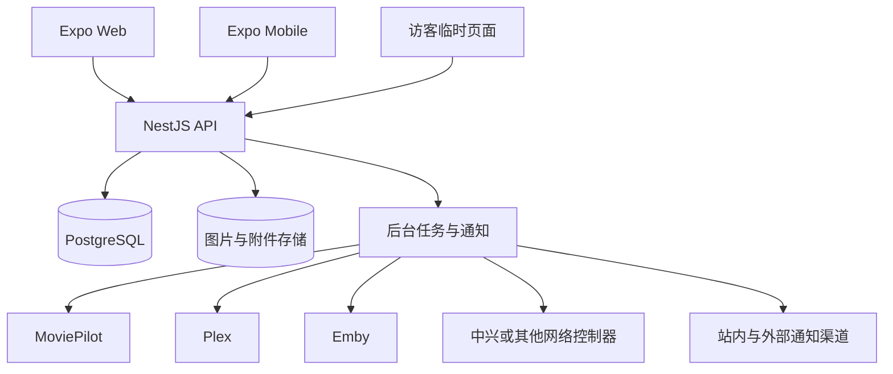

# 小管家家庭管理平台总体方案

> 文档状态：总体方向已确认，按阶段实施
> 更新日期：2026-07-30
> 当前版本：点菜、多人厨房协作、菜谱、采购库存、家庭公共能力、家庭观影片单与关联投票已进入本地 Web 演示阶段

## 1. 产品定位

小管家不是单一的点菜应用，而是一个以家庭为数据边界的生活协作平台。它负责保存家庭成员共同产生的计划、决定、偏好和历史，并连接家中已经部署的专业系统。

平台长期覆盖以下场景：

- 吃什么：菜谱、点菜、菜单安排、采购与库存。
- 看什么：家庭片单、投票、排期、媒体就绪状态与观看记录。
- 做什么：家庭日历、提醒、家务任务、积分与奖励。
- 谁来访：访客邀请、临时权限、点菜与观影协作、访客 Wi-Fi。
- 家里有什么：家庭资产、耗材、维护周期、说明书与购买凭证。
- 未来家庭阶段：在真实需求出现后增加儿童、健康、教育等模块。

平台不重复实现 MoviePilot、Plex、Emby、路由器或智能家居系统的专业能力，而是通过连接器把这些能力组织成面向家庭成员的简单流程。

## 2. 设计原则

1. **家庭是第一数据边界**：所有业务数据必须明确属于一个家庭。
2. **模块化而非万能表**：点菜、观影、访客等模块使用独立业务表，共用家庭、成员、附件、提醒和审计能力。
3. **家庭意图归本系统保存**：投票、计划、偏好、评论和历史不能依赖外部服务存在。
4. **外部事实由专业系统负责**：媒体入库、播放进度、访客网络状态等由连接器同步。
5. **高频场景优先**：先把每日可用的闭环做好，再增加低频模块。
6. **移动端优先、Web 同等可用**：手机和远程 Web 都能完成常用操作，不依赖快捷键。
7. **隐私最小化**：不收集完成功能所不需要的数据，不记录访客浏览内容。
8. **可恢复比功能数量重要**：正式保存家庭数据前，必须具备迁移、备份和恢复能力。

## 3. 产品信息架构

建议将界面组织为以下一级入口，避免每增加一个模块就增加一个底部标签：

| 一级入口 | 内容 |
| --- | --- |
| 首页 | 今日菜单、待办、日程、观影计划、低库存和访客概览 |
| 日历 | 菜单、观影、任务、来访、维护和自定义家庭事件 |
| 生活 | 点菜、菜谱、购物清单、库存 |
| 娱乐 | 家庭片单、投票、观影排期、观看历史 |
| 家庭 | 成员、任务、积分、投票、访客 |
| 设置 | 集成、权限、通知、备份、网络和系统状态 |

移动端保留 4 至 5 个高频标签，其余入口收进“家庭”或“更多”；桌面 Web 使用侧边导航展示完整模块。

## 4. 模块地图

| 模块 | 当前状态 | 目标边界 |
| --- | --- | --- |
| 点菜与菜谱 | 已实现 | 家庭菜谱、图文步骤、参考链接、早餐/午餐/晚餐和日期排期 |
| 厨房菜单 | 已实现 | 主厨分配、逐菜认领、制作进度、取消原因、提醒、操作历史和完成锁定 |
| 购物清单 | 已实现基础版 | 手动数量、删除、菜单生成、跨来源合并 |
| 家庭库存 | 已实现基础版 | 低库存提醒、补货、与食材及采购数量联动 |
| 家庭日历 | 已实现统一聚合与家庭事件 | 汇总所有模块的计划与提醒 |
| 任务与投票 | 已实现基础版 | 家务、家庭决策、周期任务、完成记录 |
| 可配置提醒 | 已实现 | 菜单、任务发生日、家庭事件与投票的多人定时提醒 |
| 积分与奖励 | 待建设 | 通用积分流水和家庭奖励，不只服务儿童 |
| 观影 | 已实现片单与排期基础版 | 片单、家庭投票、排期、外部媒体系统同步 |
| 访客 | 已确认纳入 | 临时邀请、有限权限、偏好、访客 Wi-Fi |
| 家庭资产 | 待建设 | 家电、保修、耗材、维护和文档 |
| 儿童能力 | 仅预留 | 有真实家庭需求后按阶段增加，不提前建设空模块 |

## 5. 总体技术架构

项目继续采用模块化单体：一个 API、一个 PostgreSQL 数据库和多个可替换连接器。当前规模不需要微服务，也不需要为每个模块建立独立数据库。



### 5.1 各层职责

- **Expo 客户端**：交互、展示、表单、本地会话和有限离线缓存。
- **NestJS API**：权限、业务规则、事务、外部连接器和统一响应。
- **PostgreSQL**：家庭业务的唯一持久化来源。
- **附件存储**：菜谱图片、头像、票据和说明书；数据库只保存元数据及存储键。
- **后台任务**：连接器同步、定时提醒、失败重试、备份和清理。
- **外部系统**：提供媒体自动化、媒体库、播放进度或网络设备事实。

## 6. 数据存储总体设计

### 6.1 通用约定

- 主键使用 UUID。
- 家庭业务表包含 `householdId`；唯一约束必须同时考虑 `householdId`。
- 可变数据包含 `createdAt`、`updatedAt`，重要内容支持 `deletedAt` 软删除。
- 全天计划使用 PostgreSQL `date`；具体时间使用 `timestamptz`。
- 家庭表保存 IANA 时区，当前默认为 `Asia/Shanghai`。
- 数量使用 `numeric`，同时保存明确单位。
- 外部同步记录保存 `lastSyncedAt` 和来源版本，不能假设外部服务永远在线。
- JSONB 只用于设置、外部元数据快照和审计载荷，不用于代替核心关联关系。
- 状态变化要有明确状态机；关键写操作使用事务和幂等键。

### 6.2 表命名与模块边界

继续使用同一个 PostgreSQL 数据库，通过清晰的表名前缀和 NestJS 模块划分边界：

- 核心：`households`、`accounts`、`household_members`、`member_permissions`、`auth_sessions`
- 点菜：`meal_*`
- 库存：`inventory_*`
- 采购：`shopping_*`
- 日历与任务：`calendar_*`、`tasks`、`polls`、`points_*`
- 观影：`media_*`
- 访客：`guests`、`visits`、`guest_*`
- 集成：`integrations`、`integration_*`
- 家庭资产：`home_assets`、`maintenance_*`

现有表不需要一次性全部重命名。优先补家庭归属、迁移和约束，命名整理可以采用渐进迁移。

## 7. 家庭核心模型

### 7.1 家庭与成员

目标核心表：

- `households`：家庭名称、时区、地区和非敏感设置。
- `accounts`：登录身份和凭证状态，不直接保存家庭角色。
- `household_members`：家庭内成员身份、显示名称、头像、角色和状态；可选关联账号。
- `member_permissions`：少量成员级能力覆盖，避免业务代码散落 `if child` 或固定成员名称。
- `member_preferences`：主题、通知、饮食和内容偏好等可选设置。

当前过渡模型已经落地独立 `accounts`，并保留 `members` 作为家庭成员身份与展示档案，避免重写菜单等既有业务外键。家庭权限角色统一为 `owner/admin/member`，`prefersCooking` 是独立偏好；`auth_sessions` 同时关联账号、当前家庭和成员身份，并记录刷新令牌摘要、角色及账号凭据快照。后续可以渐进增加 `member_preferences`，无需再次拆登录凭据。

当前 JWT 使用 `accountId` 作为 `sub`，同时包含 `householdId`、`memberId`、会话 ID 和家庭内角色。所有仓储查询都必须带家庭范围，不能只凭资源 ID 修改记录。正式成员通过限时一次性邀请加入；未来访客仍使用独立的临时访问模型。

### 7.2 权限能力

初期角色可以是：

- `owner`：家庭设置、集成和备份。
- `admin`：日常管理、菜谱、库存、任务和访客。
- `member`：点菜、投票、查看授权内容和完成任务。
- `guest`：只通过一次性邀请访问本次来访内容，不属于正式家庭成员。

业务判断使用能力，例如 `manage_inventory`、`manage_integrations`、`update_meal_status`，角色只提供默认能力集合。

## 8. 点菜、库存与采购

### 8.1 点菜目标模型

- `dishes`：家庭共享的菜品基础信息，菜名本身不属于某个成员。
- `dish_recipe_variants`：一道菜的家庭默认做法或成员做法；每道菜只有一个有效家庭默认做法。
- `dish_recipe_variant_steps`：每个做法独立的有序图文步骤。
- `dish_recipe_variant_links`：每个做法独立的参考链接。
- `dish_recipe_variant_ingredients`：每个做法独立的食材、数量和单位。
- `member_dish_skills`：成员会做的菜、熟练度及常用做法。
- `menus`：某天某餐次的菜单、主厨、完成状态和锁定信息。
- `menu_items`：成员点菜、备注、认领人、制作状态、取消原因，以及选定做法 ID 和不可变做法快照。
- `menu_events`：点菜、认领、状态变化、主厨变化和菜单完成的不可变审计记录；菜单划掉通知继续兼容旧读取接口，可配置提醒不写入此表。

家庭成员可以查看同一家庭内所有未归档做法。个人做法由作者或家庭管理员维护；家庭默认做法仅 `owner/admin` 可维护。点菜时默认保存家庭做法快照，认领时优先切换到认领人的常用做法，也允许在菜单中手动选择任意家庭可见做法。采购始终按菜单快照计算，避免菜谱后续编辑改变已经安排好的食材数量。详细契约与验收证据见 [独立菜谱与多人做法验收](recipe-variants-acceptance.md)。

### 8.2 库存与采购闭环

库存不能只按名称独立存在，应关联食材或家庭物品目录：

```text
菜单所需数量 - 可用库存 = 建议采购数量
采购完成              = 可选补充库存
菜单完成              = 可选扣减库存
```

目标表：

- `inventory_items`：当前数量、单位、低库存阈值、建议补货量。
- `inventory_transactions`：入库、消耗、调整和撤销流水。
- `shopping_lists`：采购日期、状态和负责人。
- `shopping_list_items`：名称、数量、单位、勾选状态和来源快照。
- `shopping_item_sources`：来源于菜单、库存补货、观影活动或手动添加。

采购生成和菜谱食材替换必须使用事务。重复提交点菜要通过数据库唯一约束或幂等键防止重复记录。

## 9. 家庭日历、提醒、任务与投票

### 9.1 统一日历

菜单、观影、访客和维护仍保存在各自业务表中，统一日历 API 负责聚合，不把所有业务复制进一个万能事件表。

- `calendar_events` 只保存用户手动创建的家庭事件。
- `reminders` 保存提醒时间、接收成员和来源引用。
- 日历查询返回统一展示模型：日期、时间、模块、标题、状态和目标页面。

### 9.2 可配置提醒

提醒是家庭公共能力，不复制来源事项：

- `reminders` 保存 `householdId`、来源模块与 ID、精确 `remindAt`、创建者和 `scheduled/sent/cancelled` 状态。
- `reminder_recipients` 保存每位接收成员、投递时间和生成的通知 ID；同一提醒与成员组合保持唯一。
- 菜单、家庭事件和投票直接引用来源 ID；周期任务额外保存 `occurrenceDate`，把提醒绑定到明确的一次发生日。
- 所有家庭成员都可为同家庭事项设置多人提醒；仅创建者或 `owner/admin` 可编辑和取消，已发送记录不可变。
- 后台调度器默认每 15 秒扫描到期提醒，通过 PostgreSQL `FOR UPDATE SKIP LOCKED` 支持多个 API 实例并行且不重复投递。
- 到期时重新校验来源。菜单已结束或无有效菜品、任务已完成/跳过/停用、投票已结束/归档时自动取消并记录 `source_unavailable`。
- 每位接收成员只生成一条 `module=reminder` 的站内通知，并直接跳回原事项。

当前提醒中心提供待提醒、已发送、已取消和全部视图；首页展示近期提醒，菜单、任务、日历和投票提供鼠标可用的快捷入口。详细契约见 [M3-D 可配置提醒验收](m3-reminders-acceptance.md)。

### 9.3 任务

- 当前支持负责人、任务日期、周期规则、认领、改派、完成、跳过、恢复和停用；参与人、检查清单与完成确认留待有真实场景时扩展。
- 周期任务按查询范围动态展开，只在改派、完成或跳过时保存实例，避免预写无限数据。
- 已处理实例独立保留，不被后续周期规则修改覆盖；修改规则时只清理尚未处理的实例。
- 任务完成可以产生积分流水，但任务模块不依赖积分一定启用。

### 9.4 投票

投票是公共能力，可服务点菜、电影、周末活动和采购决策：

- `polls`：标题、分类、截止时间、单选/多选规则和可选来源关联。
- `poll_options`：候选项及稳定排序。
- `poll_votes`：成员选择，按投票、候选项和成员建立唯一约束。

当前基础版支持整组改票、撤票、手动结束、重新开启和软删除。已有选票后锁定候选项与选择规则，但仍允许维护标题、说明、分类和未来截止时间。投票结束后不允许改票，因此结果直接由不可变选票计算，不额外维护容易漂移的 `poll_results`；未来只有在外部审计或规则变更确有需要时才增加关闭快照。`sourceModule` 与 `sourceId` 已为点菜、观影和采购等业务预留关联，开放投票已接入通用提醒来源。详细契约见 [M3-C 通用家庭投票验收](m3-polls-acceptance.md)。

### 9.5 积分

积分必须使用不可变流水，而不是直接修改成员总分：

- `points_accounts`
- `points_ledger`
- `rewards`
- `reward_redemptions`

总分由流水汇总或缓存得出，撤销通过反向流水完成。

## 10. 观影系统与媒体连接器

### 10.1 家庭观影流程

```text
搜索影视
  -> 加入家庭片单
  -> 家人投票
  -> 安排观影日期
  -> 提交 MoviePilot 订阅
  -> MoviePilot 整理完成并通知请求人
  -> Plex/Emby 确认已入库
  -> 播放并同步观看记录
```

### 10.2 数据归属

| 数据 | 权威来源 |
| --- | --- |
| 家庭片单、投票、排期、评论 | 小管家 |
| 搜索与订阅自动化状态 | MoviePilot |
| 是否入库、媒体版本、播放进度 | Plex 和/或 Emby |
| 海报、简介、演职员和分级 | TMDB 等元数据服务的本地快照 |

目标表：

- `media_titles`：与具体媒体服务器无关的影片或剧集。
- `media_external_refs`：TMDB、IMDb、MoviePilot、Plex、Emby 等外部 ID。
- `household_media`：想看、投票中、已排期、观看中、已完成等家庭状态。
- `media_votes`：成员意愿。
- `media_requests`：MoviePilot 请求与订阅状态。
- `media_library_items`：某连接器中的入库和版本状态。
- `integration_events`：外部回调的幂等审计，只保存业务匹配所需的脱敏字段。
- `viewing_sessions`：一次实际观影。
- `viewing_participants`：参与成员、进度、评分和评论。
- `viewing_progress`：剧集或长内容的成员进度。

### 10.3 连接器边界

- `MediaMetadataProvider`：搜索和元数据。
- `MediaAutomationProvider`：MoviePilot 订阅、状态和取消。
- `MediaLibraryProvider`：Plex/Emby 媒体库、播放入口和进度。

一个家庭可以同时配置 Plex、Emby 或多个媒体库实例。主要播放来源是可选的默认路由偏好，只影响同一影片存在于多个媒体库时的入口排序，不关闭其他来源；通过 TMDB/IMDb 等外部 ID 去重，不使用 Plex 或 Emby ID 作为本系统主键。

同步优先使用 Webhook，缺少 Webhook 时使用低频增量轮询。所有外部事件通过提供方事件 ID 或内容哈希实现幂等处理，并保存同步游标与失败原因。

MoviePilot 采用 GPLv3。小管家只借鉴自动化流程并通过公开 API 连接，不复制其代码，从而保持清晰的模块与许可证边界。

M4-A 已落地连接器无关的 `media_titles`、`media_external_refs` 与 `household_media`。TMDB 按电影/剧集编号空间去重，IMDb 按全局编号去重；家庭片单状态、排期和备注不依赖任何外部服务。观影排期已进入统一日历，片单变更已进入家庭活动。三个连接器接口已经冻结为契约，但在主媒体库与 API 参数确认前不实现具体提供方。详细边界见 [M4-A 家庭观影片单验收](m4-media-watchlist-acceptance.md)。

M4-B 已复用通用投票的 `sourceModule/sourceId` 建立片单来源关联。一部片单条目只能有一个进行中的家庭投票；发起、结束、重开和删除会同步 `watchlist/voting` 状态，活动、通知、权限与透明结果继续使用通用能力。跨家庭来源、并发重复和投票期间绕过状态修改均由服务端约束。详细边界见 [M4-B 观影片单关联投票验收](m4-media-polls-acceptance.md)。

M4-C 已实现可并存的 Plex/Emby `MediaLibraryProvider`、使用官方 `X-API-KEY` 的 MoviePilot `MediaAutomationProvider`、连接器健康状态、外部 ID 媒体库匹配和无凭据播放入口。服务器环境变量或密钥文件作为默认配置，家庭管理员可以建立加密的家庭覆盖、启停服务、选择主媒体库和测试连接；错误与超时不会阻断家庭片单。请求状态持久化、权限和界面操作由 M4-D 在此基础上完成。详细边界见 [M4-C 媒体连接器验收](m4-media-connectors-acceptance.md)。

M4-D 已新增独立的 `media_requests`，保存 MoviePilot 请求人、影片/季、外部请求编号、同步时间、状态与失败原因。同一影片/季只允许一条进行中订阅；正式成员可提交和刷新，请求人或家庭管理员可取消，进行中订阅会阻止影片直接移出片单。外部调用不持有数据库事务，MoviePilot 失败不修改家庭片单。移动与桌面片单已提供订阅、刷新、取消和重试操作。详细边界见 [M4-D MoviePilot 订阅请求验收](m4-media-requests-acceptance.md)。

M4-E 已实现豆瓣兼容桥接、TMDB 与 Bangumi 三源并行搜索。来源各自超时和降级，按外部编号或“类型、标准化名称、明确年份”谨慎合并，结果只保存为本地元数据与外部编号快照；任一来源离线时手动录入和家庭片单仍可用。豆瓣不内置非官方签名或网页抓取，只接受自行部署的限权兼容接口。详细边界见 [M4-E 三源影视搜索验收](m4-media-search-acceptance.md)。

M4-F 已为 `poll_options` 增加可选的真实片单引用。家庭成员可从片单选择 2 至 12 部影视发起结构化投票，候选卡展示本地海报、类型和年份并可分别回到片单。单片与多片投票共享家庭隔离、状态保护和有序事务锁；关闭、重开或归档会批量同步候选状态。普通文字投票保持不变。详细边界见 [M4-F 多片候选投票验收](m4-media-candidate-polls-acceptance.md)。

M4-G 已接入 MoviePilot `TransferComplete` 整理完成回调。家庭管理员为已有 MoviePilot 家庭连接生成或轮换一次性展示的随机回调地址，可限制精确来源 IP；服务端只保存密钥摘要，只接受白名单事件和 64 KiB 以内请求，并以规范化载荷哈希去重。回调按家庭、提供方、有效请求、TMDB 编号和剧集季严格匹配，匹配后将请求标记完成，仅通知原请求人并直达片单详情；未匹配事件只保留脱敏审计，不修改片单。详细边界见 [M4-G MoviePilot 整理完成回调验收](m4-moviepilot-webhook-acceptance.md)。

M4-H 已实现 Plex/Emby 外部用户目录与家庭成员显式映射。映射同时绑定家庭连接器和当前媒体服务器 ID，不根据用户名猜测成员；服务器变化、外部账号停用或目录中不存在时只显示为失效记录供管理员清理。目录读取、建立和取消映射均要求集成管理权限，写操作进入家庭活动，API 响应不包含凭据或服务器地址。详细边界见 [M4-H Plex/Emby 用户映射验收](m4-media-user-mappings-acceptance.md)。

M4-I 已接入 Plex 原生 multipart 与 Emby 原生 JSON 播放回调。事件先按集成密钥、精确来源 IP、64 KiB JSON 上限和载荷摘要去重，再按当前服务器、显式用户映射和已同步媒体库严格匹配；未映射账号、旧服务器和未同步媒体只保存脱敏审计。有效事件生成可追溯的观看会话、成员参与记录和成员级最新进度，重复及带时间戳的乱序事件不会重复建会话或回退进度。移动和桌面观影首页已增加独立观看记录入口。详细边界见 [M4-I 播放回调与观看记录验收](m4-playback-history-acceptance.md)。

M4-J 已增加剧集的按季入库核验。MoviePilot 的整理状态继续独立保存；家庭片单可用性接口只针对当前最新剧集请求的目标季查询 Plex/Emby，并返回该季是否存在与服务器已发现的集数。界面不会把已发现集数当作官方总集数，也不会因只匹配到整部剧而把目标季误报为可播放。详细边界见 [M4-J 剧集季入库核验](m4-series-availability-acceptance.md)。

M5-A 已实现独立访客档案、多人来访计划和限时邀请。访客不复用正式成员账号，来访通过独立参与关系关联访客；家庭管理员可安排、结束或取消来访，并为每位参与者生成只展示一次的随机确认链接。公开页面只允许访客查看自己的来访主题、时间和备注并提交参加意向，不能读取家庭成员、库存、观影、网络配置或家庭历史。来访进入统一日历，回执通知接待成员。详细边界见 [M5-A 访客与来访计划验收](m5-guest-visits-acceptance.md)。

M5-B 已增加手动访客 Wi-Fi 配置。管理员可将一个家庭内的加密 Wi-Fi 配置绑定到具体来访，仍有效的访客邀请页才显示连接二维码；停用配置、撤销/到期邀请或取消来访会立即隐藏二维码。本批不连接或控制中兴设备，不保存路由器凭据、设备标识或访客上网记录。详细边界见 [M5-B 手动访客 Wi-Fi 验收](m5-guest-wifi-acceptance.md)。

M5-C1 已支持经明确授权的访客参与观影投票。管理员创建邀请时可单独开启该能力，默认不授权；访客仅能读取开放中的观影投票并提交或修改匿名选票，不会获得家庭账号、成员身份或家庭成员投票名单。邀请撤销、到期、来访取消和投票关闭后访问立即失效。详细边界见 [M5-C1 访客观影投票验收](m5-guest-movie-voting-acceptance.md)。

M5-C2 已支持经明确授权的访客点菜请求。访客可查看本次来访期间的已安排菜单并选择菜品，也可提出菜单外需求；家庭管理员在来访页单独接受或拒绝。菜单选择保留对既有菜单项的引用，但不会改写菜单、不暴露菜谱做法或库存，也不把访客伪装为家庭成员。详细边界见 [M5-C2 访客点菜请求验收](m5-guest-meal-requests-acceptance.md)。

MoviePilot 插件市场的现有实现确认了两条可复用的事件路径：整理完成由 `TransferComplete` 事件触发，Plex/Emby/Jellyfin 的入库、播放开始和播放停止统一进入 `WebhookMessage`。同步采用“MoviePilot 负责自动化与整理完成、Plex/Emby 负责实际入库和播放状态”的边界，不要求家庭成员安装或操作 MoviePilot 插件。通用 Webhook 插件会转发全部事件且不提供签名或自定义认证头，因此不能直接作为可信入口；接收端继续使用事件白名单、独立随机密钥、来源限制、幂等键和脱敏日志。播放事件接入前必须先把外部媒体服务器用户显式映射到家庭成员，不能根据用户名猜测观看人。

## 11. 访客系统

访客不能直接创建为普通家庭成员，也不能看到库存、账单、文档和家庭历史。

目标表：

- `guests`：常用访客的最少资料和可选偏好。
- `visits`：来访时间、接待成员、主题和状态。
- `visit_guests`：一次来访的参与关系。
- `guest_invitations`：邀请码摘要、权限范围和过期时间，不保存明文 Token。
- `guest_wifi_profiles`：手动维护的 SSID、安全方式、启停状态和服务端加密密码；来访只引用选定配置。
- `guest_access_passes`：网络访问或其他临时权限。
- `guest_devices`：可选且短期保存的设备标识。
- `guest_activity_logs`：本次点菜、投票、签到等有限审计。

访客流程：

```text
家庭成员安排来访
  -> 发送临时链接或邀请码
  -> 访客确认、点菜和参与观影投票
  -> 到家后展示访客 Wi-Fi 二维码
  -> 来访结束
  -> 邀请与临时权限自动失效
```

访客页面无需安装 App，只展示本次来访明确授权的内容。常用访客可以保留饮食偏好，但访问权限每次重新签发。

## 12. 中兴网络设备与访客 Wi-Fi

网络设备通过 `NetworkControllerProvider` 连接器接入，访客业务不能依赖某个中兴型号的私有实现。

建议能力模型：

- `read_status`：读取设备和连接状态。
- `list_clients`：读取当前客户端。
- `manage_guest_network`：启用或关闭访客网络。
- `rotate_guest_password`：轮换共享访客密码。
- `create_individual_pass`：创建独立访客凭据，仅高阶设备可能支持。
- `block_client`：阻止设备，属于高风险操作，必须二次确认与审计。

接入等级取决于具体型号和运营商固件：

| 接口条件 | 接入策略 |
| --- | --- |
| 官方 REST API 或控制器接口 | 完整连接器 |
| SNMP | 以只读状态为主 |
| UPnP/IGD | 仅基础网络信息 |
| TR-069 | 通常由运营商 ACS 管理，不作为家庭控制接口 |
| 只有本地管理网页 | 最后选择；适配脆弱，默认只读 |
| 运营商锁定 | 保留手动指引，或增加 OpenWrt/UniFi/Omada 等可控 AP |

待确认信息包括中兴设备准确型号、硬件版本、固件版本及其角色（光猫、路由器或 Mesh 主节点）。任何排查文档都不得要求提交管理员密码。

路由器凭据只能在 API 服务端加密保存；移动端只调用允许列表中的操作。不得将管理后台端口开放到公网，也不记录访客浏览内容。

## 13. 家庭资产与知识库

家庭资产模块适合在公共能力稳定后建设：

- `home_assets`：家电、家具、设备、购买时间和保修期。
- `asset_documents`：说明书、购买凭证和保修材料。
- `maintenance_plans`：清洗、换滤芯、检查等周期计划。
- `maintenance_records`：执行时间、成员、费用和备注。
- `consumable_links`：耗材与库存或购物项的关联。

知识库可以保存家庭流程和说明资料，但身份证件、健康数据等敏感内容在加密、备份和权限模型完成前不纳入。

## 14. 儿童能力策略

当前没有儿童成员，因此采用“底层兼容、功能延后”的策略。

现在建设：

- 成员模型不假设所有人都是成年人。
- 权限按能力判断，而不是散落 `if child`。
- 任务、积分、奖励和审批保持通用。
- 内容偏好和影视分级按成员保存。
- 重要操作保留成员审计记录。

现在不建设：

- 作业、课程表、成长记录等专用页面。
- 婴幼儿喂养、睡眠等阶段性记录。
- 儿童健康、位置或其他敏感数据。
- 没有真实使用者的复杂家长控制规则。

未来有明确需求时，再通过迁移增加可选生日、监护关系、年龄策略和儿童专用模块。完善的迁移机制比提前创建空表更可靠。

## 15. 集成平台

所有外部系统共用以下表：

- `integrations`：家庭、提供方类型、地址、启用状态、能力和最后同步时间。
- `integration_secrets`：加密凭据；加密主密钥不进入数据库备份。
- `integration_member_mappings`：家庭成员与 Plex/Emby 等外部用户映射。
- `integration_events`：Webhook 或轮询事件、幂等键和处理结果。
- `integration_sync_cursors`：增量同步位置和失败重试状态。

连接器必须返回能力列表，前端只显示设备实际支持的操作。外部系统不可用时，家庭片单、来访记录等核心数据仍可使用。

初期连接器可以运行在 NestJS API 内。需要访问隔离网络或高风险设备时，再拆出只允许有限命令的局域网代理，不提前微服务化。

## 16. 安全与隐私

正式家庭使用前必须完成：

- PIN 使用 Argon2 或 bcrypt 哈希，不明文保存和比较。
- JWT 密钥、数据库密码和连接器 Token 从环境变量或密钥文件注入。
- 缩短访问令牌有效期并设计安全续期；登出或权限变更可撤销会话。
- 登录和访客邀请码接口加入速率限制。
- CORS 仅允许配置的客户端来源。
- 家庭级数据查询与写入全部校验 `householdId`。
- 管理集成、删除数据、封禁设备等操作加入能力校验与审计。
- 上传文件检查真实内容类型，限制尺寸并生成压缩图；未引用附件定期回收。
- 访客资料和设备映射设置保留期限，可手动匿名化或删除。
- 不采集访客浏览记录，不把网络在线状态用于隐蔽监控。
- 外网访问使用 HTTPS 与 VPN/可信反向代理，不直接暴露 API、数据库或路由器后台。

## 17. 一致性与可靠性

当前开发环境已经关闭 TypeORM 自动同步并使用显式迁移。后续继续遵守：

1. 建立 TypeORM 数据源和首个基线迁移。
2. 在开发、测试和生产环境关闭自动同步。
3. 给家庭范围和常用查询添加索引。
4. 为点菜、投票、外部事件等建立唯一约束和幂等键。
5. 将购物清单重建、菜谱食材替换、库存流水等放进事务。
6. 为状态更新增加合法转换校验，禁止任意跳转。
7. 使用乐观锁或版本字段处理多人同时编辑。

## 18. 备份与恢复

Docker 卷不是备份。完整备份包含：

- PostgreSQL `pg_dump` 自定义格式文件。
- 图片与附件存储归档。
- 非敏感配置和版本清单。
- 文件校验和及备份时间。

连接器 Token 等敏感信息应加密保存，加密主密钥独立保管。建议每日增量或快照、每周完整备份，并保留至少一个不在当前主机上的副本。

恢复流程必须脚本化并定期演练：新建空数据库、恢复数据、恢复附件、运行迁移、执行健康检查和关键流程冒烟测试。

## 19. 部署方案

### 19.1 开发与演示

- Docker Compose：PostgreSQL、种子任务和 NestJS API。
- 宿主机：Expo Web/Expo Go 开发服务器。
- 数据库端口只绑定本机；API 可按局域网需求暴露。

### 19.2 家庭长期运行

建议建立单独的生产 Compose：

- `api`
- `db`
- `web` 静态构建或反向代理
- `backup`
- 可选 `worker`

生产环境使用固定镜像而不是源码热重载，配置健康检查、重启策略、日志轮转、备份目录和资源限制。远程访问优先通过 VPN 或可信反向代理。

## 20. 测试与可观测性

### 20.1 测试层次

- API 单元测试：状态机、数量计算、权限和连接器映射。
- PostgreSQL 集成测试：事务、唯一约束、迁移和家庭隔离。
- API 冒烟测试：登录、点菜、接单、采购、库存和日历。
- Playwright：已固定鼠标登录、390 像素移动视口和桌面 Web 的核心页面导航，并检查运行时错误与横向溢出。
- 连接器契约测试：使用固定响应模拟 MoviePilot、Plex、Emby 和网络控制器。
- 备份恢复测试：从备份启动空环境并执行验证。

### 20.2 运行状态

- API、数据库和连接器独立健康状态。
- 结构化日志包含请求 ID、家庭 ID 和连接器名称，不记录 Token。
- 集成失败显示最后成功时间、错误摘要和重试入口。
- 后台任务保存运行记录，避免失败被静默忽略。

## 21. 分阶段路线图

### M1：点菜本地演示版（已完成）

- Docker Compose API 与 PostgreSQL。
- Expo Web 移动端模拟与桌面布局。
- 早餐、日期日历和点菜日期标记。
- 菜谱图文步骤与参考链接。
- 购物清单数量、删除和家庭库存。
- 厨房菜单点菜高亮。

### M2：平台稳定化（已完成）

M2-A 数据安全批次已于 2026-07-28 完成：现有数据已备份并迁移到默认家庭，TypeORM 自动同步已关闭，业务查询已加入家庭范围，备份恢复脚本与家庭隔离测试已落地。

M2-B 认证与一致性批次已于 2026-07-28 完成：当时的成员 PIN 改用 bcrypt（M2-G 已迁入账号密码），JWT 缩短为 12 小时并动态校验成员，登录限流和 CORS 白名单已启用；角色能力、菜单状态机、重复点菜唯一索引以及菜谱、点菜和购物清单事务已落地。迁移已在干净数据库、备份恢复数据库和当前开发数据库验证，业务数据行数保持不变。

M2-C 厨房协作批次已于 2026-07-28 完成：家庭权限角色与掌勺偏好已经拆分；每餐主厨、逐菜认领、取消原因、点菜人站内提醒、菜单操作历史和完成锁定已经落地。新增迁移在临时数据库完成旧数据回填、结构漂移检查、家庭隔离和事务回归。

M2-D 前端质量批次已于 2026-07-28 完成：Expo 官方 ESLint 规则已经接入；Playwright 使用本机 Chrome 通过鼠标登录，并用独立可撤销会话验证 390 x 844 移动视口与 1440 x 900 桌面视口。回归覆盖首页、点菜、菜单历史、采购库存和个人页，不执行点菜、状态、偏好或库存修改，同时检查控制台异常和页面横向溢出。

M2-E 会话安全批次已于 2026-07-28 完成：访问 JWT 缩短为 15 分钟，新增服务端 `auth_sessions` 与 30 天轮换刷新令牌，数据库只保存令牌摘要；登出、角色变化和登录凭据变化会永久撤销旧会话。Expo 客户端支持启动续期与并发请求单飞续期，原生端使用 `SecureStore`，Web 演示明确保留 `localStorage` 的 XSS 边界。

M2-F 可观测性与部署批次已于 2026-07-28 完成：API 为每个请求生成或校验请求 ID，错误响应、结构化访问日志和异常摘要共享该 ID；日志只记录路由模板、状态、耗时及账号/家庭/成员 UUID，并自动跳过成功的健康轮询。新增独立存活与数据库就绪检查、文件型密钥、可信代理配置、固定生产镜像、Caddy HTTPS、内部网络、资源与日志限制及生产备份模板。回归测试同时修复了启动续期与延迟 `401` 之间的令牌轮换竞态。

M2-G 账号与验收批次已于 2026-07-29 完成：全局账号与家庭成员档案已渐进拆分，JWT 和服务端会话同时保存账号及当前家庭身份；匿名成员枚举已关闭，新增文件密钥保护的单次首户初始化、账号密码补设、限时成员邀请及撤销/过期/防重放。迁移在空库、旧 PIN 库、当前开发库和提交 `608d28d` 的真实备份恢复库完成验证，关键业务行数一致。冻结约定与证据见 [M2 平台稳定化验收](m2-acceptance.md)。

- `households`、账号和家庭成员基础模型。
- 所有现有数据回填 `householdId`。
- TypeORM 迁移并关闭自动同步。
- 备份与恢复脚本。
- 旧 PIN 哈希迁移、账号密码、角色能力、CORS 和速率限制。
- 短时访问令牌、刷新轮换、服务端撤销和客户端自动续期。
- 请求 ID、最小化结构化日志、独立健康检查和生产部署模板。
- 独立账号、首户初始化、成员邀请和账号密码管理。
- Docker secrets、Caddy HTTPS、固定镜像和生产备份配置。
- 重复点菜防护、事务和状态机。
- 主厨与逐菜认领、取消提醒、操作审计和历史菜单锁定。
- 正式 API 集成测试与 Playwright 回归测试。

验收标准：从备份可恢复到空环境；不同家庭无法访问彼此数据；重复请求不会产生重复记录；退出或权限/凭据变化后旧会话立即失效。

### M3：家庭公共能力

M3-A 统一日历批次已于 2026-07-29 完成：新增 `calendar_events` 保存手动家庭事件；`GET /calendar` 在查询时聚合现有菜单餐次和家庭事件，不复制菜单数据。独立日历页支持历史及未来月份浏览、菜单数量与事件标记、家庭事件新建/编辑/删除，以及跳转指定日期的菜单安排。创建者可管理自己的事件，`owner/admin` 可管理家庭内全部事件；家庭隔离、范围校验和双视口鼠标回归已纳入自动测试。接口与数据边界见 [M3-A 统一日历验收](m3-calendar-acceptance.md)。

菜谱独立化批次已于 2026-07-29 完成：菜品与做法版本分离，每道菜可同时展示家庭默认做法和所有成员做法；新增成员厨艺、熟练度与常用做法关联。菜单保存选定做法快照，认领可自动采用成员常用做法，采购按快照计算。旧菜品接口继续同步家庭默认做法，迁移不丢失原有图文步骤、链接和食材。接口、权限与数据约定见 [独立菜谱与多人做法验收](recipe-variants-acceptance.md)。

M3-B 家庭任务与通用通知批次已于 2026-07-29 完成：新增独立任务模板、按需生成的周期实例与成员级通知；任务进入首页和统一日历，支持一次性、每日、每周、每月规则以及认领、改派、完成、跳过、恢复和停用。菜单划掉提醒已接入统一通知并与旧接口双向同步已读状态。接口、权限和实例边界见 [M3-B 家庭任务与通用通知验收](m3-tasks-acceptance.md)。

M3-C 通用家庭投票批次已于 2026-07-29 完成：新增家庭范围的投票、候选项和成员选票，支持单选、多选、截止时间、整组改票、撤票、结束、重新开启和软删除。家庭内透明展示票数、参与比例和投票成员；已有选票后锁定规则，写操作通过事务与投票行锁保持一致。投票发起、结束和重开接入站内通知，并预留来源关联供点菜、观影和采购复用。接口、权限与结果边界见 [M3-C 通用家庭投票验收](m3-polls-acceptance.md)。

M3-D 可配置提醒批次已于 2026-07-29 完成：新增独立提醒、接收成员和后台调度能力，统一关联菜单、任务发生日、家庭事件与投票，不复制来源内容。成员可设置精确时间和多人接收、编辑或取消自己的提醒；`owner/admin` 可协助管理。调度器通过行锁和跳过已锁记录避免多实例重复投递，来源失效时自动取消；提醒中心、首页、通知中心及四类来源快捷入口均已接入。接口、权限与投递边界见 [M3-D 可配置提醒验收](m3-reminders-acceptance.md)。

M3-E 成员管理与家庭活动批次已于 2026-07-29 完成：新增家庭内成员停用状态，保持全局账号与家庭身份分离；`owner/admin` 可管理成员档案、角色和家庭访问，最后一位管理员、越权管理和会话撤销均由服务端约束。新增不可变家庭管理审计，并在查询时聚合既有菜单事件形成家庭活动流，不复制完整业务数据。移动端从“我的”进入，桌面端提供侧栏入口，移动底栏仍为 6 项。接口、权限和活动数据边界见 [M3-E 成员管理与家庭活动验收](m3-members-activity-acceptance.md)。

- [x] 统一日历。
- [x] 通用任务、周期实例和站内通知。
- [x] 通用投票。
- [x] 可配置定时提醒。
- [x] 活动记录和成员管理界面。

验收标准：点菜、任务和自定义事件可在同一日历展示；每个成员只收到授权提醒。

### M4：观影 MVP 与连接器

- [x] 连接器无关的影视元数据、家庭片单、状态和排期。
- [x] `MediaMetadataProvider`、`MediaAutomationProvider`、`MediaLibraryProvider` 契约。
- [x] 统一日历、家庭活动和移动/桌面观影页面。
- [x] 从片单发起家庭投票、来源回链与状态同步。
- [x] Plex 与 Emby 可并存的健康检查、媒体匹配和播放入口。
- [x] MoviePilot 官方 API Key 认证、订阅与取消适配器契约。
- [x] 豆瓣兼容桥接、TMDB 与 Bangumi 三源在线元数据搜索。
- [x] 家庭级三源设置、加密凭据与服务器默认配置回退。
- [x] 家庭级 Plex/Emby/MoviePilot 设置、主媒体库与连接测试。
- [x] 结构化多片候选投票。
- [x] MoviePilot 请求状态持久化、家庭权限与订阅界面。
- [x] MoviePilot 整理完成回调、媒体就绪通知与脱敏事件审计。
- [x] Plex/Emby 外部用户目录与家庭成员显式映射。
- [x] Plex/Emby 播放事件、观看会话与成员进度。
- [x] 独立访客档案、来访计划、限时确认链接与受限访客页面。
- [x] 手动访客 Wi-Fi 配置、来访绑定与限时二维码展示。
- [x] 经邀请明确授权的访客观影投票与匿名统计。
- [x] 经邀请明确授权的访客点菜请求与家庭处理。

验收标准：家庭片单不依赖外部系统存在；同一影片在多个外部系统中可正确去重；连接器离线不影响家庭数据。

### M5：访客与家庭网络

- [x] 访客、来访计划、临时邀请和有限页面。
- [x] 访客点菜请求。
- [x] 经授权的访客观影投票。
- [x] 手动访客 Wi-Fi 二维码。
- 根据中兴具体型号实现只读或可控连接器。
- 临时权限自动失效和访客数据清理。

验收标准：访客无法访问任何未授权家庭数据；到期链接不可复用；网络高风险操作有确认与审计。

### M6：家庭运营

- 库存与采购自动差额计算。
- 家庭资产、维护周期和文档。
- 积分流水、奖励与兑换。
- 通知渠道和更多连接器。

### M7：按真实需求扩展

- 儿童相关能力。
- 家庭财务、健康、出行或家庭回忆。
- Home Assistant 等智能家居连接器。

这些模块只有在数据安全、权限和使用场景明确后进入实施。

## 22. 下一次实施范围

前端质量门禁可以通过 `corepack pnpm lint`、`corepack pnpm typecheck` 和 `corepack pnpm test:web` 重复执行。M2、M3 已冻结，M4 的片单、三源搜索、单片/多片投票、订阅请求、媒体连接设置、MoviePilot 整理完成通知、Plex/Emby 用户映射以及观看记录已经完成。下一次实施范围：

1. 在 NAS 的 Plex 中配置真实播放 Webhook，验证 Mac API 的局域网可达性、来源 IP 和已映射账号；Emby 部署后复用同一流程。
2. 使用轮换后的 Plex Token 和 MoviePilot API Key 完成 NAS 真实数据只读验收，并核对剧集事件能用 Plex `grandparentRatingKey` 或 Emby `SeriesId` 关联已同步剧集。
3. 待中兴设备型号确认后，评估只读网络连接器；根据真实使用反馈评估访客请求采纳到正式菜单的显式流程。

访客系统继续使用独立临时权限模型，不与正式家庭成员或媒体连接器凭据混用。

## 23. 待确认事项

- 中兴网络设备型号、硬件版本、固件版本和设备角色。
- 轮换后的 Plex 限权 Token 与 MoviePilot API Key。
- Emby 的部署地址、版本和只读 API Key（启用时）。
- 家庭长期运行主机与备份目的地。
- 外网访问采用 VPN 还是反向代理。
- TMDB 限权 Token 与经审核的豆瓣兼容桥接地址（启用对应来源时）。

这些事项不阻塞 M2 平台稳定化，但会决定后续连接器的实现细节。
