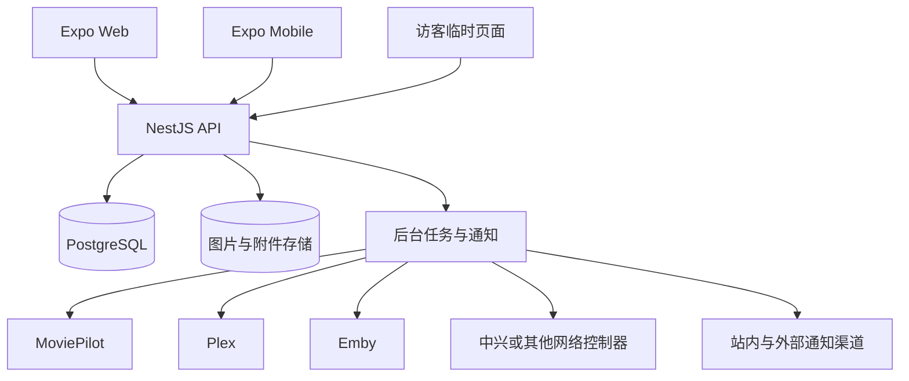

# 小管家家庭管理平台总体方案

> 文档状态：总体方向已确认，按阶段实施
> 更新日期：2026-07-28
> 当前版本：点菜、菜单、菜谱、购物清单与家庭库存已进入本地 Web 演示阶段

## 1. 产品定位

小管家不是单一的点菜应用，而是一个以家庭为数据边界的生活协作平台。它负责保存家庭成员共同产生的计划、决定、偏好和历史，并连接家中已经部署的专业系统。

平台长期覆盖以下场景：

- 吃什么：菜谱、点菜、菜单安排、采购与库存。
- 看什么：家庭片单、投票、排期、媒体就绪状态与观看记录。
- 做什么：家庭日历、提醒、家务任务、积分与奖励。
- 谁来访：访客邀请、临时权限、点菜与观影协作、访客 Wi-Fi。
- 家里有什么：家庭资产、耗材、维护周期、说明书与购买凭证。
- 未来家庭阶段：在真实需求出现后增加儿童、健康、教育等模块。

平台不重复实现 MoviePilot、Plex、Emby、路由器或智能家居系统的专业能力，而是通过连接器把这些能力组织成面向家庭成员的简单流程。

## 2. 设计原则

1. **家庭是第一数据边界**：所有业务数据必须明确属于一个家庭。
2. **模块化而非万能表**：点菜、观影、访客等模块使用独立业务表，共用家庭、成员、附件、提醒和审计能力。
3. **家庭意图归本系统保存**：投票、计划、偏好、评论和历史不能依赖外部服务存在。
4. **外部事实由专业系统负责**：媒体入库、播放进度、访客网络状态等由连接器同步。
5. **高频场景优先**：先把每日可用的闭环做好，再增加低频模块。
6. **移动端优先、Web 同等可用**：手机和远程 Web 都能完成常用操作，不依赖快捷键。
7. **隐私最小化**：不收集完成功能所不需要的数据，不记录访客浏览内容。
8. **可恢复比功能数量重要**：正式保存家庭数据前，必须具备迁移、备份和恢复能力。

## 3. 产品信息架构

建议将界面组织为以下一级入口，避免每增加一个模块就增加一个底部标签：

| 一级入口 | 内容 |
| --- | --- |
| 首页 | 今日菜单、待办、日程、观影计划、低库存和访客概览 |
| 日历 | 菜单、观影、任务、来访、维护和自定义家庭事件 |
| 生活 | 点菜、菜谱、购物清单、库存 |
| 娱乐 | 家庭片单、投票、观影排期、观看历史 |
| 家庭 | 成员、任务、积分、投票、访客 |
| 设置 | 集成、权限、通知、备份、网络和系统状态 |

移动端保留 4 至 5 个高频标签，其余入口收进“家庭”或“更多”；桌面 Web 使用侧边导航展示完整模块。

## 4. 模块地图

| 模块 | 当前状态 | 目标边界 |
| --- | --- | --- |
| 点菜与菜谱 | 已实现 | 家庭菜谱、图文步骤、参考链接、早餐/午餐/晚餐和日期排期 |
| 厨房菜单 | 已实现 | 接单、制作、完成、拒绝和点菜高亮 |
| 购物清单 | 已实现基础版 | 手动数量、删除、菜单生成、跨来源合并 |
| 家庭库存 | 已实现基础版 | 低库存提醒、补货、与食材及采购数量联动 |
| 家庭日历 | 已实现菜单日期标记 | 汇总所有模块的计划与提醒 |
| 任务与投票 | 待建设 | 家务、家庭决策、周期任务、完成记录 |
| 积分与奖励 | 待建设 | 通用积分流水和家庭奖励，不只服务儿童 |
| 观影 | 待建设 | 片单、家庭投票、排期、外部媒体系统同步 |
| 访客 | 已确认纳入 | 临时邀请、有限权限、偏好、访客 Wi-Fi |
| 家庭资产 | 待建设 | 家电、保修、耗材、维护和文档 |
| 儿童能力 | 仅预留 | 有真实家庭需求后按阶段增加，不提前建设空模块 |

## 5. 总体技术架构

项目继续采用模块化单体：一个 API、一个 PostgreSQL 数据库和多个可替换连接器。当前规模不需要微服务，也不需要为每个模块建立独立数据库。



### 5.1 各层职责

- **Expo 客户端**：交互、展示、表单、本地会话和有限离线缓存。
- **NestJS API**：权限、业务规则、事务、外部连接器和统一响应。
- **PostgreSQL**：家庭业务的唯一持久化来源。
- **附件存储**：菜谱图片、头像、票据和说明书；数据库只保存元数据及存储键。
- **后台任务**：连接器同步、定时提醒、失败重试、备份和清理。
- **外部系统**：提供媒体自动化、媒体库、播放进度或网络设备事实。

## 6. 数据存储总体设计

### 6.1 通用约定

- 主键使用 UUID。
- 家庭业务表包含 `householdId`；唯一约束必须同时考虑 `householdId`。
- 可变数据包含 `createdAt`、`updatedAt`，重要内容支持 `deletedAt` 软删除。
- 全天计划使用 PostgreSQL `date`；具体时间使用 `timestamptz`。
- 家庭表保存 IANA 时区，当前默认为 `Asia/Shanghai`。
- 数量使用 `numeric`，同时保存明确单位。
- 外部同步记录保存 `lastSyncedAt` 和来源版本，不能假设外部服务永远在线。
- JSONB 只用于设置、外部元数据快照和审计载荷，不用于代替核心关联关系。
- 状态变化要有明确状态机；关键写操作使用事务和幂等键。

### 6.2 表命名与模块边界

继续使用同一个 PostgreSQL 数据库，通过清晰的表名前缀和 NestJS 模块划分边界：

- 核心：`households`、`accounts`、`household_members`、`member_permissions`
- 点菜：`meal_*`
- 库存：`inventory_*`
- 采购：`shopping_*`
- 日历与任务：`calendar_*`、`tasks`、`polls`、`points_*`
- 观影：`media_*`
- 访客：`guests`、`visits`、`guest_*`
- 集成：`integrations`、`integration_*`
- 家庭资产：`home_assets`、`maintenance_*`

现有表不需要一次性全部重命名。优先补家庭归属、迁移和约束，命名整理可以采用渐进迁移。

## 7. 家庭核心模型

### 7.1 家庭与成员

目标核心表：

- `households`：家庭名称、时区、地区和非敏感设置。
- `accounts`：登录身份和凭证状态，不直接保存家庭角色。
- `household_members`：家庭内成员身份、显示名称、头像、角色和状态；可选关联账号。
- `member_permissions`：少量成员级能力覆盖，避免业务代码散落 `if child` 或固定成员名称。
- `member_preferences`：主题、通知、饮食和内容偏好等可选设置。

JWT 应包含当前 `accountId`、`householdId`、`memberId` 和家庭内角色。所有仓储查询都必须带家庭范围，不能只凭资源 ID 修改记录。

### 7.2 权限能力

初期角色可以是：

- `owner`：家庭设置、集成和备份。
- `adult`：日常管理、菜谱、库存、任务和访客。
- `member`：点菜、投票、查看授权内容和完成任务。
- `guest`：只通过一次性邀请访问本次来访内容，不属于正式家庭成员。

业务判断使用能力，例如 `manage_inventory`、`manage_integrations`、`update_meal_status`，角色只提供默认能力集合。

## 8. 点菜、库存与采购

### 8.1 点菜目标模型

- `meal_dishes`：家庭菜品基础信息。
- `meal_recipe_steps`：有序图文步骤，图片关联附件表。
- `meal_reference_links`：菜谱参考链接。
- `meal_ingredients`：家庭食材目录。
- `meal_dish_ingredients`：菜品所需数量和单位。
- `meal_plans`：某天某餐次的菜单。
- `meal_orders`：成员点菜、备注和状态。

现有菜谱步骤暂存在 JSONB 中，功能稳定后可迁移到独立表，以支持排序、图片回收和后续版本历史。

### 8.2 库存与采购闭环

库存不能只按名称独立存在，应关联食材或家庭物品目录：

```text
菜单所需数量 - 可用库存 = 建议采购数量
采购完成              = 可选补充库存
菜单完成              = 可选扣减库存
```

目标表：

- `inventory_items`：当前数量、单位、低库存阈值、建议补货量。
- `inventory_transactions`：入库、消耗、调整和撤销流水。
- `shopping_lists`：采购日期、状态和负责人。
- `shopping_list_items`：名称、数量、单位、勾选状态和来源快照。
- `shopping_item_sources`：来源于菜单、库存补货、观影活动或手动添加。

采购生成和菜谱食材替换必须使用事务。重复提交点菜要通过数据库唯一约束或幂等键防止重复记录。

## 9. 家庭日历、提醒、任务与投票

### 9.1 统一日历

菜单、观影、访客和维护仍保存在各自业务表中，统一日历 API 负责聚合，不把所有业务复制进一个万能事件表。

- `calendar_events` 只保存用户手动创建的家庭事件。
- `reminders` 保存提醒时间、接收成员和来源引用。
- 日历查询返回统一展示模型：日期、时间、模块、标题、状态和目标页面。

### 9.2 任务

- 支持负责人、参与人、截止时间、周期规则、检查清单和完成确认。
- 周期任务按规则生成实例，历史实例不能被未来规则修改覆盖。
- 任务完成可以产生积分流水，但任务模块不依赖积分一定启用。

### 9.3 投票

投票是公共能力，可服务点菜、电影、周末活动和采购决策：

- `polls`：标题、截止时间、规则和关联业务。
- `poll_options`：候选项。
- `poll_votes`：成员选择，按规则建立唯一约束。
- `poll_results`：必要时保存关闭时的结果快照。

### 9.4 积分

积分必须使用不可变流水，而不是直接修改成员总分：

- `points_accounts`
- `points_ledger`
- `rewards`
- `reward_redemptions`

总分由流水汇总或缓存得出，撤销通过反向流水完成。

## 10. 观影系统与媒体连接器

### 10.1 家庭观影流程

```text
搜索影视
  -> 加入家庭片单
  -> 家人投票
  -> 安排观影日期
  -> 提交 MoviePilot 订阅
  -> Plex/Emby 检测已入库
  -> 通知家人
  -> 播放并同步观看记录
```

### 10.2 数据归属

| 数据 | 权威来源 |
| --- | --- |
| 家庭片单、投票、排期、评论 | 小管家 |
| 搜索与订阅自动化状态 | MoviePilot |
| 是否入库、媒体版本、播放进度 | Plex 或 Emby |
| 海报、简介、演职员和分级 | TMDB 等元数据服务的本地快照 |

目标表：

- `media_titles`：与具体媒体服务器无关的影片或剧集。
- `media_external_refs`：TMDB、IMDb、MoviePilot、Plex、Emby 等外部 ID。
- `household_media`：想看、投票中、已排期、观看中、已完成等家庭状态。
- `media_votes`：成员意愿。
- `media_requests`：MoviePilot 请求与订阅状态。
- `media_library_items`：某连接器中的入库和版本状态。
- `viewing_sessions`：一次实际观影。
- `viewing_participants`：参与成员、进度、评分和评论。
- `viewing_progress`：剧集或长内容的成员进度。

### 10.3 连接器边界

- `MediaMetadataProvider`：搜索和元数据。
- `MediaAutomationProvider`：MoviePilot 订阅、状态和取消。
- `MediaLibraryProvider`：Plex/Emby 媒体库、播放入口和进度。

一个家庭可以配置多个媒体库连接器，但应指定一个主要播放来源；通过 TMDB/IMDb 等外部 ID 去重，不使用 Plex 或 Emby ID 作为本系统主键。

同步优先使用 Webhook，缺少 Webhook 时使用低频增量轮询。所有外部事件通过提供方事件 ID 或内容哈希实现幂等处理，并保存同步游标与失败原因。

MoviePilot 采用 GPLv3。小管家只借鉴自动化流程并通过公开 API 连接，不复制其代码，从而保持清晰的模块与许可证边界。

## 11. 访客系统

访客不能直接创建为普通家庭成员，也不能看到库存、账单、文档和家庭历史。

目标表：

- `guests`：常用访客的最少资料和可选偏好。
- `visits`：来访时间、接待成员、主题和状态。
- `visit_guests`：一次来访的参与关系。
- `guest_invitations`：邀请码摘要、权限范围和过期时间，不保存明文 Token。
- `guest_access_passes`：网络访问或其他临时权限。
- `guest_devices`：可选且短期保存的设备标识。
- `guest_activity_logs`：本次点菜、投票、签到等有限审计。

访客流程：

```text
家庭成员安排来访
  -> 发送临时链接或邀请码
  -> 访客确认、点菜和参与观影投票
  -> 到家后展示访客 Wi-Fi 二维码
  -> 来访结束
  -> 邀请与临时权限自动失效
```

访客页面无需安装 App，只展示本次来访明确授权的内容。常用访客可以保留饮食偏好，但访问权限每次重新签发。

## 12. 中兴网络设备与访客 Wi-Fi

网络设备通过 `NetworkControllerProvider` 连接器接入，访客业务不能依赖某个中兴型号的私有实现。

建议能力模型：

- `read_status`：读取设备和连接状态。
- `list_clients`：读取当前客户端。
- `manage_guest_network`：启用或关闭访客网络。
- `rotate_guest_password`：轮换共享访客密码。
- `create_individual_pass`：创建独立访客凭据，仅高阶设备可能支持。
- `block_client`：阻止设备，属于高风险操作，必须二次确认与审计。

接入等级取决于具体型号和运营商固件：

| 接口条件 | 接入策略 |
| --- | --- |
| 官方 REST API 或控制器接口 | 完整连接器 |
| SNMP | 以只读状态为主 |
| UPnP/IGD | 仅基础网络信息 |
| TR-069 | 通常由运营商 ACS 管理，不作为家庭控制接口 |
| 只有本地管理网页 | 最后选择；适配脆弱，默认只读 |
| 运营商锁定 | 保留手动指引，或增加 OpenWrt/UniFi/Omada 等可控 AP |

待确认信息包括中兴设备准确型号、硬件版本、固件版本及其角色（光猫、路由器或 Mesh 主节点）。任何排查文档都不得要求提交管理员密码。

路由器凭据只能在 API 服务端加密保存；移动端只调用允许列表中的操作。不得将管理后台端口开放到公网，也不记录访客浏览内容。

## 13. 家庭资产与知识库

家庭资产模块适合在公共能力稳定后建设：

- `home_assets`：家电、家具、设备、购买时间和保修期。
- `asset_documents`：说明书、购买凭证和保修材料。
- `maintenance_plans`：清洗、换滤芯、检查等周期计划。
- `maintenance_records`：执行时间、成员、费用和备注。
- `consumable_links`：耗材与库存或购物项的关联。

知识库可以保存家庭流程和说明资料，但身份证件、健康数据等敏感内容在加密、备份和权限模型完成前不纳入。

## 14. 儿童能力策略

当前没有儿童成员，因此采用“底层兼容、功能延后”的策略。

现在建设：

- 成员模型不假设所有人都是成年人。
- 权限按能力判断，而不是散落 `if child`。
- 任务、积分、奖励和审批保持通用。
- 内容偏好和影视分级按成员保存。
- 重要操作保留成员审计记录。

现在不建设：

- 作业、课程表、成长记录等专用页面。
- 婴幼儿喂养、睡眠等阶段性记录。
- 儿童健康、位置或其他敏感数据。
- 没有真实使用者的复杂家长控制规则。

未来有明确需求时，再通过迁移增加可选生日、监护关系、年龄策略和儿童专用模块。完善的迁移机制比提前创建空表更可靠。

## 15. 集成平台

所有外部系统共用以下表：

- `integrations`：家庭、提供方类型、地址、启用状态、能力和最后同步时间。
- `integration_secrets`：加密凭据；加密主密钥不进入数据库备份。
- `integration_member_mappings`：家庭成员与 Plex/Emby 等外部用户映射。
- `integration_events`：Webhook 或轮询事件、幂等键和处理结果。
- `integration_sync_cursors`：增量同步位置和失败重试状态。

连接器必须返回能力列表，前端只显示设备实际支持的操作。外部系统不可用时，家庭片单、来访记录等核心数据仍可使用。

初期连接器可以运行在 NestJS API 内。需要访问隔离网络或高风险设备时，再拆出只允许有限命令的局域网代理，不提前微服务化。

## 16. 安全与隐私

正式家庭使用前必须完成：

- PIN 使用 Argon2 或 bcrypt 哈希，不明文保存和比较。
- JWT 密钥、数据库密码和连接器 Token 从环境变量或密钥文件注入。
- 缩短访问令牌有效期并设计安全续期；登出或权限变更可撤销会话。
- 登录和访客邀请码接口加入速率限制。
- CORS 仅允许配置的客户端来源。
- 家庭级数据查询与写入全部校验 `householdId`。
- 管理集成、删除数据、封禁设备等操作加入能力校验与审计。
- 上传文件检查真实内容类型，限制尺寸并生成压缩图；未引用附件定期回收。
- 访客资料和设备映射设置保留期限，可手动匿名化或删除。
- 不采集访客浏览记录，不把网络在线状态用于隐蔽监控。
- 外网访问使用 HTTPS 与 VPN/可信反向代理，不直接暴露 API、数据库或路由器后台。

## 17. 一致性与可靠性

当前原型使用 TypeORM `synchronize: true`，仅适合本地演示。平台稳定化阶段必须：

1. 建立 TypeORM 数据源和首个基线迁移。
2. 在开发、测试和生产环境关闭自动同步。
3. 给家庭范围和常用查询添加索引。
4. 为点菜、投票、外部事件等建立唯一约束和幂等键。
5. 将购物清单重建、菜谱食材替换、库存流水等放进事务。
6. 为状态更新增加合法转换校验，禁止任意跳转。
7. 使用乐观锁或版本字段处理多人同时编辑。

## 18. 备份与恢复

Docker 卷不是备份。完整备份包含：

- PostgreSQL `pg_dump` 自定义格式文件。
- 图片与附件存储归档。
- 非敏感配置和版本清单。
- 文件校验和及备份时间。

连接器 Token 等敏感信息应加密保存，加密主密钥独立保管。建议每日增量或快照、每周完整备份，并保留至少一个不在当前主机上的副本。

恢复流程必须脚本化并定期演练：新建空数据库、恢复数据、恢复附件、运行迁移、执行健康检查和关键流程冒烟测试。

## 19. 部署方案

### 19.1 开发与演示

- Docker Compose：PostgreSQL、种子任务和 NestJS API。
- 宿主机：Expo Web/Expo Go 开发服务器。
- 数据库端口只绑定本机；API 可按局域网需求暴露。

### 19.2 家庭长期运行

建议建立单独的生产 Compose：

- `api`
- `db`
- `web` 静态构建或反向代理
- `backup`
- 可选 `worker`

生产环境使用固定镜像而不是源码热重载，配置健康检查、重启策略、日志轮转、备份目录和资源限制。远程访问优先通过 VPN 或可信反向代理。

## 20. 测试与可观测性

### 20.1 测试层次

- API 单元测试：状态机、数量计算、权限和连接器映射。
- PostgreSQL 集成测试：事务、唯一约束、迁移和家庭隔离。
- API 冒烟测试：登录、点菜、接单、采购、库存和日历。
- Playwright：390 像素移动视口和桌面 Web 的关键流程。
- 连接器契约测试：使用固定响应模拟 MoviePilot、Plex、Emby 和网络控制器。
- 备份恢复测试：从备份启动空环境并执行验证。

### 20.2 运行状态

- API、数据库和连接器独立健康状态。
- 结构化日志包含请求 ID、家庭 ID 和连接器名称，不记录 Token。
- 集成失败显示最后成功时间、错误摘要和重试入口。
- 后台任务保存运行记录，避免失败被静默忽略。

## 21. 分阶段路线图

### M1：点菜本地演示版（已完成）

- Docker Compose API 与 PostgreSQL。
- Expo Web 移动端模拟与桌面布局。
- 早餐、日期日历和点菜日期标记。
- 菜谱图文步骤与参考链接。
- 购物清单数量、删除和家庭库存。
- 厨房菜单点菜高亮。

### M2：平台稳定化（进行中）

M2-A 数据安全批次已于 2026-07-28 完成：现有数据已备份并迁移到默认家庭，TypeORM 自动同步已关闭，业务查询已加入家庭范围，备份恢复脚本与家庭隔离测试已落地。

下一批 M2-B 聚焦认证与业务一致性：PIN 哈希、角色能力、CORS、速率限制、重复点菜防护、事务和状态机。

- `households`、账号和家庭成员基础模型。
- 所有现有数据回填 `householdId`。
- TypeORM 迁移并关闭自动同步。
- 备份与恢复脚本。
- PIN 哈希、角色能力、CORS 和速率限制。
- 重复点菜防护、事务和状态机。
- 正式 API 集成测试与 Playwright 回归测试。

验收标准：从备份可恢复到空环境；不同家庭无法访问彼此数据；重复请求不会产生重复记录。

### M3：家庭公共能力

- 统一日历和提醒。
- 通用任务、周期任务和通知。
- 通用投票。
- 活动记录和成员管理界面。

验收标准：点菜、任务和自定义事件可在同一日历展示；每个成员只收到授权提醒。

### M4：观影 MVP 与连接器

- 元数据搜索、家庭片单、投票和排期。
- `MediaMetadataProvider` 与媒体数据模型。
- 先接入实际作为主媒体库的 Plex 或 Emby。
- 再接入 MoviePilot 请求与订阅状态。
- 播放入口、观看记录和通知。

验收标准：家庭片单不依赖外部系统存在；同一影片在多个外部系统中可正确去重；连接器离线不影响家庭数据。

### M5：访客与家庭网络

- 访客、来访计划、临时邀请和有限页面。
- 访客点菜与观影投票。
- 手动访客 Wi-Fi 二维码。
- 根据中兴具体型号实现只读或可控连接器。
- 临时权限自动失效和访客数据清理。

验收标准：访客无法访问任何未授权家庭数据；到期链接不可复用；网络高风险操作有确认与审计。

### M6：家庭运营

- 库存与采购自动差额计算。
- 家庭资产、维护周期和文档。
- 积分流水、奖励与兑换。
- 通知渠道和更多连接器。

### M7：按真实需求扩展

- 儿童相关能力。
- 家庭财务、健康、出行或家庭回忆。
- Home Assistant 等智能家居连接器。

这些模块只有在数据安全、权限和使用场景明确后进入实施。

## 22. 下一次实施范围

下一次代码迭代应严格聚焦 M2，不同时启动观影或访客 UI：

1. 冻结并备份当前开发数据。
2. 建立 TypeORM 迁移基础设施。
3. 新建默认家庭并迁移现有成员及业务数据。
4. 引入家庭范围的认证与权限上下文。
5. 增加备份、恢复和环境健康脚本。
6. 修复重复点菜、事务和状态转换问题。
7. 把现有浏览器验收固化为可重复测试。

完成 M2 后，公共日历、观影和访客模块才能建立在稳定的数据边界上。

## 23. 待确认事项

- 中兴网络设备型号、硬件版本、固件版本和设备角色。
- Plex 与 Emby 中哪个作为主要播放来源。
- MoviePilot 的部署地址、认证方式和可用 API 版本。
- 家庭长期运行主机与备份目的地。
- 外网访问采用 VPN 还是反向代理。
- 影视元数据服务及 API 凭据来源。

这些事项不阻塞 M2 平台稳定化，但会决定后续连接器的实现细节。
