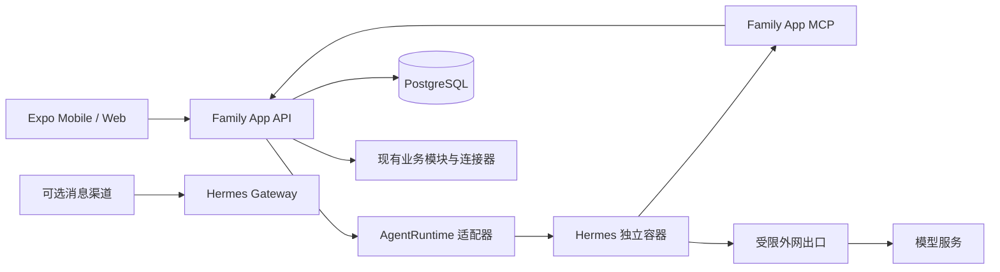

# M7-A4 家庭智能体与后续能力实施方案

> 文档状态：M7-A4.1 至 M7-A4.6 已实施，M7-A4.7 Docker 生产加固待后续批次
> 更新日期：2026-08-04
> 目标分支：`uitest`
> 首选运行时：Hermes Agent 独立容器

## 1. 目标

本批为“小管家”增加可选的自然语言入口，让家庭成员可以查询现有家庭数据、生成结构化操作提案，并在明确确认后复用现有业务服务执行操作。

智能体不是新的业务权威，也不替代现有“今日家庭助理”。今日助理继续以确定性查询聚合菜单、任务、提醒、购物、来访、维护、出行和回忆；Hermes 仅负责自然语言理解、工具选择和回答组织。Hermes、模型服务或网络不可用时，现有家庭功能必须完整可用。

首批目标：

- 在 NestJS 中建立可替换的 `AgentRuntime` 契约，首个实现连接 Hermes。
- 在独立 Docker 容器中运行 Hermes，不把 Python 依赖合入 API 镜像。
- Family App 通过内部网络调用 Hermes，Hermes 只通过受控 MCP 工具访问 Family App。
- 首批开放只读查询，后续写操作必须先生成操作提案并由用户确认。
- 所有访问继续受家庭隔离、成员权限、短时授权、幂等、事务和审计约束。
- 普通用户通过手机优先的“问问小管家”使用；管理员在后台管理运行时、工具范围、保留期和健康状态。
- 本地 Web 的所有核心交互支持鼠标和触控，不依赖键盘快捷键。

## 2. 非目标

首批明确不做：

- 不允许 Hermes 直接连接 PostgreSQL、Docker Socket、NAS 管理后台或宿主机文件系统。
- 不允许 Hermes 持有 Family App 用户 JWT、数据库密码、Plex Token、MoviePilot API Key 或备份密钥。
- 不开放 shell、终端、浏览器自动化、任意 HTTP 请求或任意 SQL 工具。
- 不允许模型自行决定家庭、成员或权限范围。
- 不静默执行库存扣减、成员管理、集成设置、备份恢复、访客网络控制等操作。
- 不把 Hermes Dashboard 作为普通用户前端，也不直接暴露到公网。
- 不在首批实现长期自主任务、自我修改技能或无人监督的自动化。
- 不因接入智能体而提前采集财务、健康、儿童、精确位置、证件或账号凭据数据。

## 3. 核心决策

### 3.1 Family App 保持业务权威

菜单、库存、任务、投票、提醒、知识库和其他家庭事实仍由现有 NestJS 模块与 PostgreSQL 保存。Hermes 只能调用有明确输入、输出和权限契约的工具；工具内部复用现有 service，不复制业务规则。

### 3.2 Hermes 是可替换运行时

API 只依赖内部 `AgentRuntime` 接口，不在控制器或业务模块中直接使用 Hermes 特有协议：

```ts
interface AgentRuntime {
  health(): Promise<AgentRuntimeHealth>;
  chat(input: AgentChatInput): Promise<AgentChatResult>;
  cancel(runId: string): Promise<void>;
}
```

实现至少包括：

- `HermesAgentRuntime`：生产与集成环境使用。
- `FakeAgentRuntime`：API 回归和前端自动化使用，不依赖模型、网络、Token 或费用。

未来替换为其他 Agent、私有模型或托管运行时时，只增加适配器，不迁移家庭业务数据。

### 3.3 查询可直接返回，写入必须提案确认

只读工具可以直接返回结果。任何改变家庭事实的意图都先写入结构化 `agent_action_proposals`，由 Family App 计算预计变化并在前端展示。用户点击确认后，API 重新检查当前身份、权限、资源版本和业务状态，再调用现有服务执行。

模型输出不能直接作为数据库写入参数。提案载荷必须通过服务端 DTO、白名单枚举、长度限制和来源资源校验。

## 4. 总体架构



App 内对话的标准路径：

```text
成员登录 Family App
  -> POST /agent/conversations/:id/messages
  -> API 校验家庭、成员、速率与功能开关
  -> API 创建短时委托令牌并调用 Hermes
  -> Hermes 选择 family-app MCP 工具
  -> MCP 再次校验令牌、工具范围和 runId
  -> NestJS service 查询或生成操作提案
  -> Hermes 组织回答
  -> API 保存必要审计并返回 App
```

## 5. Docker 与网络

### 5.1 部署形式

新增可选 Compose 文件 `docker-compose.agent.yml`，与现有开发或生产 Compose 叠加：

```bash
docker compose \
  -f docker-compose.prod.yml \
  -f docker-compose.agent.yml \
  up -d
```

不启用该文件时，Family App 继续正常运行；Agent 入口显示未配置状态，不影响核心健康检查。

### 5.2 容器约束

- 使用经过验收并固定版本或 digest 的 Hermes 镜像，不使用漂移的 `latest`。
- 为 Family App 建立新的专用 Hermes profile 和持久卷，不挂载个人 `~/.hermes`。
- Hermes 数据卷只保存该家庭平台的配置、必要会话状态和运行日志。
- 不挂载 Docker Socket、项目源码、API 上传卷、数据库卷、备份目录或宿主机主目录。
- 不使用 `network_mode: host`，不赋予 privileged 权限，启用 `no-new-privileges`。
- 生产环境不发布 Hermes API 或 Dashboard 端口；仅在 Docker 内 `expose`。
- 开发环境如需 Dashboard，只绑定 `127.0.0.1`，启用独立认证且不复用 Family App 密码。
- 配置 CPU、内存、PID、临时目录和日志轮转限制；不需要浏览器工具时不安装或不启用浏览器能力。

### 5.3 网络分区

建议增加：

- `backend`：API 与 PostgreSQL；Hermes 不加入。
- `agent_link`：仅 API 与 Hermes，标记为内部网络。
- `agent_egress`：Hermes 与出口代理；API 和数据库不加入。
- 出口代理只允许实际模型提供方和启用的消息平台域名。

容器间使用服务名：API 为 `http://api:3100`，Hermes Gateway 为 `http://hermes:8642`。浏览器不直接调用 Hermes，因此无需对 Hermes 开放 CORS 或公网端口。

### 5.4 密钥

- API 调用 Hermes 使用独立 `AGENT_RUNTIME_KEY`。
- Hermes 调用 MCP 使用每次运行签发的短时委托令牌，不使用家庭级永久万能 Token。
- 模型密钥只进入 Hermes 容器，不进入 Family App 数据库、前端包、日志或文档。
- 生产密钥通过 Docker Secret 或只读密钥文件注入；Compose 不保存明文值。
- 轮换运行时密钥不会改变家庭账号密码或撤销普通登录会话。

## 6. 身份、权限与短时委托

### 6.1 双向认证

Family App 到 Hermes 使用服务间认证；Hermes 到 Family MCP 使用短时委托令牌。委托声明至少包含：

```text
issuer
audience
householdId
memberId
accountId
sessionId
agentRunId
allowedTools
issuedAt
expiresAt
nonce
```

有效期建议不超过五分钟，并绑定一次 `agentRunId`。MCP 不接受模型参数中的 `householdId`、`memberId` 或角色作为授权依据。

### 6.2 能力

新增能力建议：

- `use_agent`：使用 App 内智能助理和只读工具。
- `manage_agent`：配置运行时、模型别名、工具开关、保留期和渠道绑定。

确认提案不使用统一的“Agent 写入”超级权限，而是重新检查来源模块已有能力。例如确认库存调整继续要求库存管理能力，确认普通任务继续使用任务模块现有规则。

### 6.3 消息渠道

消息渠道放到 App 内对话稳定之后。外部账号必须通过一次性配对码绑定正式家庭成员，保存平台、外部账号摘要、家庭成员和撤销状态。每条消息重新检查绑定状态和成员状态，不根据用户名或显示名猜测成员。

首批消息渠道只读。写操作仍返回可在 Family App 内打开的短时提案链接，避免聊天平台上的误触和身份混淆。

## 7. MCP 工具目录

### 7.1 第一阶段只读工具

| 工具 | 数据范围 | 主要返回 |
| --- | --- | --- |
| `family-app:get_today_summary` | 当前家庭与成员 | 今日菜单、任务、提醒、购物、来访和维护摘要 |
| `family-app:get_calendar` | 指定日期范围 | 授权可见的统一日历事项 |
| `family-app:get_tasks` | 最多 32 天 | 待办、状态、负责人和积分 |
| `family-app:get_shopping_list` | 指定日期 | 待采购项、数量、单位和库存关联状态 |
| `family-app:get_meal_plan` | 指定日期 | 已有三餐菜单、菜品状态和掌勺人 |
| `family-app:get_inventory_alerts` | 当前家庭 | 低库存及后续临期批次 |
| `family-app:get_menu_shopping_gap` | 指定菜单 | 菜谱快照、库存抵扣和建议采购 |
| `family-app:search_knowledge` | 当前家庭 | 标题、摘要、标签和授权参考链接 |
| `family-app:get_travel_checklist` | 指定行程 | 进度、待办和成员分工 |
| `family-app:get_watch_candidates` | 当前家庭 | 候选影片、投票和媒体就绪状态 |
| `family-app:get_recent_memories` | 当前家庭 | 非敏感回忆摘要和短时图片引用 |

查询工具必须限制日期范围、结果条数和响应大小。知识库正文、回忆故事、访客备注和外部元数据作为不可信内容返回，不能改变后续工具权限。

### 7.2 第二阶段提案工具

| 工具 | 提案内容 | 确认后执行 |
| --- | --- | --- |
| `family-app:propose_task` | 标题、日期、负责人、周期和积分 | 现有任务创建服务 |
| `family-app:propose_reminder` | 来源、时间和接收成员 | 现有提醒服务 |
| `family-app:propose_poll` | 标题、候选项、规则和截止时间 | 现有投票服务 |
| `family-app:propose_menu` | 日期、餐次、菜品、做法和主厨 | 现有菜单与点菜服务 |
| `family-app:propose_shopping_items` | 名称、数量、单位、来源和库存关联 | 现有购物清单服务 |
| `family-app:propose_guest_request_adoption` | 访客请求、目标菜单和做法 | 后续访客采纳服务 |

提案只保存可验证的结构化负载和预计变化，不执行数据库写入之外的业务副作用。确认时使用提案指纹和家庭范围幂等键，重复点击、接口重试和并发确认只能产生一次结果。

### 7.3 禁止工具

首批不注册：

- 任意 SQL、文件读写、shell、Docker、浏览器、任意 URL 抓取。
- 读取或修改集成密钥、账号凭据、备份内容和服务器环境变量。
- 管理成员角色、停用成员、初始化家庭或重置密码。
- 执行备份恢复、删除数据、封禁网络设备或修改路由器设置。
- 直接确认库存扣减、奖励审批或其他需要当前用户明确确认的操作。

## 8. 数据模型

按有序 TypeORM 迁移新增，`synchronize` 保持 `false`：

### 8.1 `agent_settings`

- `householdId`
- `enabled`
- `runtimeKind`
- `runtimeProfile`
- `modelAlias`
- `retentionDays`
- `readToolsEnabled`
- `proposalToolsEnabled`
- `version`
- `updatedByMemberId`
- `createdAt`、`updatedAt`

运行时地址和服务密钥属于部署配置，不保存在普通设置行。

### 8.2 `agent_conversations`

- `householdId`
- `createdByMemberId`
- `source`：`app` 或受支持消息平台
- `externalThreadRefHash`
- `title`
- `status`：`active`、`archived`、`expired`
- `expiresAt`
- `createdAt`、`updatedAt`

### 8.3 `agent_messages`

- `householdId`
- `conversationId`
- `memberId`
- `role`
- `contentCiphertext`
- `contentNonce`
- `contentVersion`
- `createdAt`

对话正文使用独立 Agent 数据密钥加密，并按家庭配置自动清理。第一版默认保留七天；家庭成员可以清空自己的对话，管理员不能通过普通活动审计读取正文。若不配置内容加密密钥，则降级为不持久化正文，而不是明文保存。

### 8.4 `agent_runs`

- `householdId`
- `conversationId`
- `requestedByMemberId`
- `runtimeKind`、`runtimeVersion`、`modelAlias`
- `status`：`queued`、`running`、`completed`、`failed`、`cancelled`
- `startedAt`、`finishedAt`
- `inputTokens`、`outputTokens`、`estimatedCost`
- `errorCode`

不保存密钥、完整提示词、工具完整返回或敏感错误堆栈。

### 8.5 `agent_tool_events`

- `householdId`
- `runId`
- `toolName`
- `sourceModule`、`sourceId`
- `status`
- `inputSummary`、`outputSummary`
- `startedAt`、`finishedAt`

该表为不可变审计；摘要只保存必要标识、数量和结果状态，不复制知识库正文、回忆故事或访客备注。

### 8.6 `agent_action_proposals`

- `householdId`
- `runId`
- `createdByMemberId`
- `actionType`
- `payload`
- `preview`
- `requestFingerprint`
- `idempotencyKey`
- `expectedSourceVersion`
- `status`：`pending`、`confirmed`、`executed`、`rejected`、`expired`、`failed`
- `confirmedByMemberId`
- `expiresAt`、`confirmedAt`、`executedAt`
- `resultModule`、`resultId`
- `version`

状态转换使用事务行锁和预期版本。历史提案不删除；拒绝、过期和失败保留脱敏事实，正文随会话保留策略清理。

### 8.7 `agent_member_channels`

消息渠道批次增加：家庭、成员、平台、外部账号哈希与脱敏摘要、配对时间、最后使用时间、撤销时间和版本。活动绑定按家庭、平台和外部账号哈希唯一；撤销只改变状态，不删除历史。

### 8.8 `agent_channel_pairings`

一次性配对码只保存 SHA-256 哈希，记录目标成员、平台、创建者、过期时间、使用时间、撤销时间、绑定 ID、幂等键和版本。配对码只在创建响应中显示一次；重复创建请求返回同一记录但不重新返回明文码。

## 9. 前端体验

### 9.1 普通成员

- 首页保留现有“今日家庭助理”，增加轻量“问问小管家”入口。
- 手机使用全屏对话页或可向下拖动关闭的移动弹层；桌面使用主内容区，不嵌套卡片。
- 提供与当前上下文相关的快捷提问，但不把首页改成聊天应用。
- 工具执行展示明确状态：正在查询、需要确认、已执行、已拒绝、已过期、失败或 Agent 离线。
- 提案卡展示来源、目标、预计新增/修改内容、库存或通知变化，以及“确认”和“放弃”。
- 确认、放弃、停止生成和重试均提供不少于 44px 的鼠标/触控目标。
- 消息发送后允许取消；网络失败保留输入草稿，不重复创建运行。
- 不依赖回车、Escape 或其他快捷键完成核心流程。

### 9.2 管理后台

- Agent 启停、运行时健康、模型别名、工具开关、每日限额和保留天数。
- 最近失败、延迟、Token/费用摘要和工具调用统计。
- 消息渠道配对与撤销。
- 不显示服务密钥、模型密钥、完整家庭对话或完整工具载荷。

## 10. 安全与可靠性

### 10.1 提示注入防护

- 系统指令与工具描述由部署配置固定，家庭内容不能覆盖。
- 工具结果标注为不可信数据，并使用结构化 JSON 而非拼接可执行指令。
- Hermes profile 只启用 Family MCP 白名单，禁用不需要的内置工具和技能。
- 工具调用必须符合 JSON Schema；未知字段拒绝，字符串、数组、日期范围和响应大小设上限。
- 对模型返回的链接、Markdown 和附件引用进行前端安全渲染，不执行内嵌 HTML 或脚本。

### 10.2 降级

- Hermes 超时、限流或离线时返回明确的 `agent_unavailable`，不伪造回答。
- 今日助理和各业务页面不依赖 Agent 健康。
- Agent API 使用独立就绪状态，不让 Hermes 故障导致主 API `/health/ready` 失败。
- 连续失败触发短时熔断；用户可稍后重试，不自动无限重放。
- 已创建但未确认的提案在运行时故障后仍可由 Family App 展示和处理。

### 10.3 并发与幂等

- 每条用户消息带客户端幂等键，重复发送只对应一个 `agent_run`。
- 每个工具调用绑定 `runId`、工具名和序号，重复调用返回同一逻辑结果或安全重算只读查询。
- 提案确认在事务中锁定提案与来源资源，并重新检查版本和权限。
- 模型超时后到达的迟延结果不能覆盖已取消运行。

### 10.4 隐私和保留

- 默认不把完整家庭数据库、活动流或附件批量发送给模型。
- 每次只提供回答所需的最小结果，并限制时间范围和条数。
- 知识库正文和回忆只在成员明确查询时进入模型上下文。
- 不向模型发送密码、Token、证件、健康、支付、精确位置或备份内容。
- 提供家庭级保留期和成员级清空；清理操作保留不含正文的审计事实。

## 11. 实施批次

### M7-A4.1 运行时基础与只读工具

- 新增 `AgentRuntime`、`HermesAgentRuntime` 和 `FakeAgentRuntime`。
- 新增设置、会话、运行和工具审计迁移。
- 新增短时委托令牌与内部 MCP 端点。
- 实现首批只读工具、结果限制和能力检查。
- 新增运行时健康、超时、取消、限流和熔断。
- 新增可选 `docker-compose.agent.yml`，不接触现有个人 Hermes 数据。

### M7-A4.2 App 内“问问小管家”

- 新增普通成员对话入口、对话页、生成状态和取消。
- 增加移动/桌面响应式布局、鼠标/触控操作和可拖动弹层。
- 管理后台增加 Agent 健康、启停、工具开关和保留设置。
- Hermes 离线时保留今日助理并显示清晰降级状态。

### M7-A4.3 操作提案与确认

- 已增加提案表、状态机、预计变化和确认卡。
- 已接入任务、提醒、投票、菜单和购物清单五类提案工具。
- 确认时使用事务行锁、预期版本、家庭级确认幂等键，并复用现有业务 service 与模块权限。
- 提案确认前重新检查当前成员、Agent 工具开关、来源运行、关联成员、事项、菜品、做法和菜单状态。
- 失败、拒绝和过期提案保留脱敏历史；PostgreSQL 触发器禁止删除提案。
- 当前五类创建操作没有统一安全撤销契约，因此不显示伪造的撤销入口。

### M7-A4.4 消息渠道配对与只读使用

- 新增 `agent_member_channels` 与 `agent_channel_pairings` 有序迁移，实体元数据与迁移结构保持一致。
- 管理员可按家庭成员和平台生成一次性配对码；配对码支持幂等创建、过期、撤销和并发消费。
- Hermes 内部入口通过独立 Bearer 校验完成配对，外部账号只保存哈希、显示名和末四位提示，不保存密码或机器人 Token。
- 已绑定渠道的消息按外部线程复用加密会话；运行只授权 `readToolsEnabled`，不会直接执行写操作。
- 渠道发送和运行查询均再次校验绑定、成员状态、家庭范围和幂等键；撤销后新消息立即拒绝。
- App 内“问问小管家”增加管理员配对/撤销入口和成员绑定状态；本批不宣称 Telegram、Discord 或 NAS 网关已经接通。

### M7-A4.5 日常查询扩展

- 增加家庭任务、指定日期购物清单和已有三餐菜单三个只读工具，Family MCP 白名单扩充到 15 个工具。
- 日期范围、条数、家庭、成员和运行授权继续由 API 限制，菜单查询不创建空菜单。
- Fake 降级运行时与 Hermes 使用相同的授权工具集合，Hermes 不可用时核心查询仍可完成。

### M7-A4.6 会话呈现增强

- 任务、购物和菜单结果生成加密结构化展示卡片，卡片与不可变工具事件和来源运行关联。
- 对话流显示工具查询进度和完成状态，结果卡片支持鼠标或触控进入对应业务页面。
- 失败、取消和 Hermes 降级回答允许明确重试；重试沿用原始问题，不创建重复用户消息，并通过幂等键和唯一重试链处理并发。
- 卡片只保存展示所需的精简字段，不保存知识正文、回忆正文、凭据或外部集成密钥。

### M7-A4.7 Docker 生产加固

- 固定 Hermes 镜像 digest，建立专用数据卷、备份边界和升级回滚流程。
- 验证内部网络、出口允许列表、资源限制、日志脱敏和非 root 运行。
- 验证 Hermes 故障、模型不可用、密钥轮换和容器重启时核心业务不受影响。
- 生产备份默认不包含模型密钥；对话数据是否纳入备份由独立加密与保留策略决定。

## 12. 测试与验收

### 12.1 API 回归

- 使用 `FakeAgentRuntime` 覆盖查询、取消、超时、限流、幂等和状态转换。
- 覆盖跨家庭访问、停用成员、过期会话、权限变化和伪造 `householdId`。
- 覆盖工具白名单、未知工具、超范围日期、过大响应和恶意知识库内容。
- 覆盖重复工具调用、重复确认、并发确认、来源版本变化和提案过期。
- 覆盖 Hermes 离线、迟延返回、模型限流和无效结构化输出。
- 现有全量 API 回归必须继续通过。

### 12.2 Hermes 契约

- 使用固定 Hermes 镜像执行健康、认证、对话取消和 MCP 工具发现测试。
- 契约测试使用测试模型或可控响应，不依赖个人会话、个人 profile 或真实家庭数据。
- 验证 Hermes 容器无法连接 PostgreSQL、无法读取上传卷、无法访问 Docker Socket。
- 验证未允许的外网地址被拒绝，模型提供方和启用消息平台可达。

### 12.3 数据库与迁移

- 变更前运行 `./scripts/backup-dev.sh`。
- 在空库、当前开发库备份恢复库和临时测试库演练有序 TypeORM 迁移。
- 检查 `synchronize: false`、结构漂移、不可变审计触发器和历史数据行数。
- 测试结束清理测试家庭、临时附件和测试数据库，不删除现有家庭数据。

### 12.4 前端与浏览器

- API/mobile TypeScript、mobile lint 和 Expo Web export 必须通过。
- Playwright 覆盖 390 x 844 与 1440 x 900，使用鼠标/触控完成发送、取消、确认和放弃。
- 检查加载、流式响应、离线、超时、已确认、重复确认和权限失败状态。
- 检查对话和提案无横向溢出、遮挡、布局跳动及不可触达按钮。
- 不重置账号密码；登录态不可用时如实记录需要人工登录的浏览器验证缺口。

### 12.5 Docker 与运行态

- 重建 API、Web、backup-worker 和 Hermes 镜像。
- 验证 PostgreSQL/API/Web/Hermes 健康及容器重启恢复。
- 验证不启用 Agent Compose 时 API/Web 仍可用。
- 验证密钥、提示词正文和家庭私密内容不进入 Docker 日志。

## 13. M7-A4 完成标准

- 普通成员可以在 App 内使用只读智能助理，并且回答来自当前家庭授权数据。
- Hermes 在独立容器内运行，只能通过 Family MCP 获取数据。
- Hermes 不可直接访问数据库、Docker、上传卷、备份目录或 NAS 密钥。
- 所有写入先展示预计变化并由用户以鼠标或触控确认。
- 重复点击、接口重试和并发确认不会产生重复业务变化。
- 跨家庭、权限变化、委托过期和伪造身份均被拒绝并留下脱敏审计。
- Hermes 或模型故障不影响今日助理和其他家庭功能。
- 全量 API 回归、迁移演练、TypeScript、lint、Web export、浏览器回归和 Docker 健康检查通过。
- 文档、镜像版本、密钥边界、回滚方式和未完成的真实消息渠道联调均如实记录。

## 14. 后续产品能力路线图

以下内容来自前期产品讨论，当前均未实现，不应因智能体接入而被遗漏。

### M7-A5.1 纪念日与共享相册

- 生日、结婚纪念日和家庭事件倒计时，接入统一日历与提醒。
- 回忆按家庭事件组织为相册，支持封面、批量上传、排序和归档。
- 提供“往年今天”，但不做人脸识别、公开分享或精确位置分析。
- Agent 可以查询纪念日和生成相册整理建议，不能自动发布或识别人脸。

### M7-A5.2 食品批次、保质期与智能菜单

- 同一库存项支持多个采购批次、生产日期、保质期和开封日期。
- 提供临期/过期提醒；扣库预览默认建议先进先出，仍由用户确认。
- 根据库存、临期批次、菜单历史和成员偏好生成一周菜单候选。
- 智能菜单只生成提案，可一键转为家庭投票，确认后才建立菜单和采购差额。
- 不在没有明确换算规则时自动转换单位，也不从自由名称猜测库存关联。

### M7-A5.3 访客采纳、家庭周报与知识库附件

- 将访客点菜请求明确采纳到指定菜单，并选择做法、餐次和主厨，保留来源链接且防重复采纳。
- 生成菜单、任务、库存、采购、来访、维护、出行和回忆的家庭周报；管理员额外看到备份与连接器状态，不做成员排名。
- 知识库增加私有图片、PDF 和说明书附件，复用短时签名、家庭隔离和附件审计。
- 后续如做本地文本提取，必须与原附件分离并允许删除，不把文件自动发送给外部模型。

### M7-A5.4 PWA、离线与 Home Assistant

- Web 支持 PWA 安装和核心只读缓存。
- 购物、任务和出行勾选可在弱网下排队，恢复连接后按幂等键同步；冲突由用户选择，不静默覆盖。
- Home Assistant 首批只读设备状态和家庭场景；执行场景必须确认并审计。
- 智能体只能通过 Family App 的 Home Assistant 白名单工具调用场景，不接触长期 Token 或任意服务调用。

### 暂缓能力

儿童、财务和健康继续保持底层兼容、业务延后。只有真实成员、字段级加密、细粒度授权、保留策略和访问审计均明确后，才单独立项。

## 15. 推荐实施顺序

1. M7-A4.1：运行时抽象、Hermes Docker、短时委托和只读 MCP。
2. M7-A4.2：App 内对话与管理员设置。
3. M7-A4.3：任务、提醒、投票、菜单和购物提案确认。
4. M7-A5.1：纪念日与共享相册。
5. M7-A5.2：食品批次、保质期与智能菜单。
6. M7-A5.3：访客采纳、家庭周报和知识库附件。
7. M7-A4.4/A4.7：真实消息渠道与 Docker 生产加固。
8. M7-A5.4：PWA、离线和 Home Assistant。

这个顺序先建立受控智能入口，再增加最有生活感和每日价值的数据能力；智能菜单依赖食品批次，消息渠道和智能家居则在 App 内授权、确认和审计稳定之后开放。

## 16. 实施前待确认

- 生产环境首选模型提供方、模型别名、费用上限和故障回退策略。
- App 对话正文默认保留期是否采用七天。
- 第一阶段是否完全禁止 Hermes 内置 Web、终端、记忆和技能学习能力；本方案默认全部禁止，仅启用 Family MCP。
- 首个消息渠道是否沿用当前 Hermes 已配置渠道，或先只做 App 内对话。
- Hermes 专用数据卷是否纳入家庭备份；模型密钥永不进入普通备份。
- NAS 部署时模型服务的出口地址和允许列表。

这些选择不阻塞 `AgentRuntime`、Fake Runtime、只读 MCP 和 App 内对话的开发；涉及真实外部消息投递、费用或生产密钥时再进行部署级确认。
