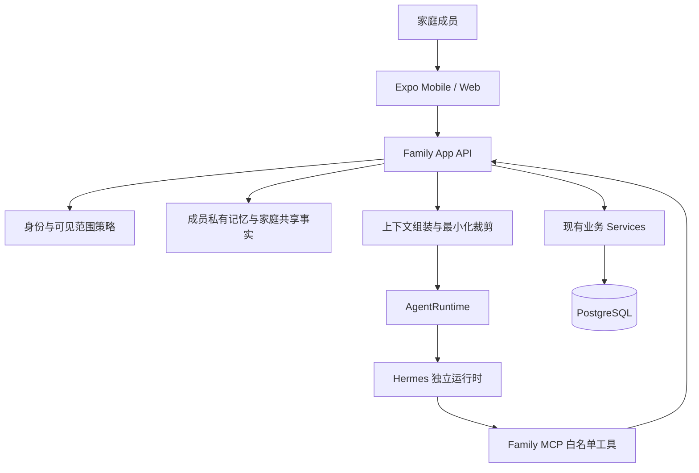

# M7-A6/A7 统一专属管家、家庭上下文与长期记忆实施方案

> 文档状态：待 Claude 审核的设计草案，尚未进入实施
> 更新日期：2026-08-06
> 目标分支：`uitest`
> 依赖基线：M7-A4.1 至 M7-A4.6、M7-A5.2 已完成
> 首选运行时：Hermes Agent；Family App 保持身份、权限、记忆与业务权威

## 1. 审核摘要

本方案收敛此前关于普通成员信息架构、家庭智能体、个人秘书和长期记忆的讨论，提出以下核心决策：

1. 每个家庭成员只面对一个“我的小管家”，不要求用户切换“家庭管家”和“个人秘书”。
2. 家庭智能体不作为第二个前台人格存在，而是后台的家庭共享上下文与协调能力。
3. 一个 Hermes 运行时承载多个逻辑成员档案，不为每个成员启动独立容器或复制业务数据。
4. Family App API 根据当前成员、会话、数据可见范围和本次授权组装上下文；Hermes 不自行决定身份或权限。
5. 长期记忆由 Family App 管理，借鉴 OpenClaw 的连续记忆体验，但不采用不可审计的自由文件记忆作为家庭数据权威。
6. 个人聊天产生的记忆默认仅本人可见；家庭业务数据继续作为结构化家庭事实，不复制成模型自由记忆。
7. 任何影响家庭共享事实的操作继续走结构化提案、预计变化、明确确认、幂等和审计。
8. 普通成员首页不再承担模块目录；功能回归食堂、安排、观影、我的等具体应用，小管家作为全局上下文入口存在。

Claude 审核应重点判断：身份与隐私边界是否可靠、数据模型是否过度设计、记忆生命周期是否可验证、多成员并发与迁移是否完整，以及实施批次是否需要调整。

## 2. 当前基线

### 2.1 已实现能力

- Hermes 通过可替换 `AgentRuntime` 接入，另有不依赖模型和网络的 `FakeAgentRuntime`。
- Hermes 只能通过 Family MCP 白名单工具访问业务数据，不能直接连接 PostgreSQL。
- Agent 设置按家庭保存；管理员可以启停、选择运行时和配置允许的工具。
- 会话按 `householdId` 与 `createdByMemberId` 隔离，每个成员只能读取自己的 App 对话。
- 运行绑定家庭、成员、会话、短时授权、允许工具、幂等键和状态机。
- 对话正文和结构化展示卡使用 Agent 数据密钥加密保存并按保留期清理。
- 当前开放 10 个只读工具和 5 个操作提案工具。
- 任务、提醒、投票、菜单和购物写入必须先生成提案，用户确认后复用现有业务服务执行。
- 普通成员首页已经初步精简，但仍通过“更多家庭内容”暴露较多模块入口。

### 2.2 当前缺口

- 没有正式的成员级 Agent 档案，家庭只有一套 Agent 设置。
- 没有独立、可查看、可纠正、可撤销的长期记忆模型。
- 家庭共享事实、成员公开偏好和成员私有记忆还没有统一的可见范围契约。
- Hermes 每次主要依赖当前会话历史和工具调用，跨会话连续性有限。
- 只有任务、购物和菜单形成完整结构化结果卡，其他工具仍偏文本回答。
- 小管家是独立页面，尚未稳定接收当前业务页面的受控上下文。
- 家庭周报、个人晨间计划、临期提醒和来访准备等例行能力尚未形成统一机制。
- 当前业务模型以家庭协作为主，真正的“仅本人可见任务/提醒”尚未定义，不能假装已经具备完整私人秘书能力。

## 3. 目标与非目标

### 3.1 产品目标

- 用户始终只与自己的专属小管家对话。
- 小管家既理解本人，又能在授权范围内理解家庭共享状态。
- 用户无需理解运行时、MCP、家庭协调器或多个 Agent 的技术结构。
- 小管家能够持续记住明确的个人偏好，并让用户知道记住了什么。
- 涉及家庭共享数据时，用户能清楚看到影响范围和受影响成员。
- Hermes 离线、模型限流或记忆功能停用时，家庭核心功能继续可用。

### 3.2 技术目标

- 一个 Hermes 运行时支持多个逻辑成员档案和并发会话。
- Family App 统一执行身份、授权、记忆检索、上下文裁剪、提案确认和审计。
- 记忆、业务事实和模型回答之间保持清晰边界。
- 所有新增表通过有序 TypeORM 迁移演进，`synchronize` 保持 `false`。
- 本地 Mac 与未来 NAS/Docker 部署使用同一数据契约，不迁移到 Hermes 私有数据格式。

### 3.3 非目标

- 不重新安装或重新引入完整 OpenClaw 运行时。
- 不为每个成员运行独立 Hermes 容器、独立数据库或独立模型。
- 不让 Hermes 自由读写文件、任意长期记忆、Shell、浏览器、Docker 或数据库。
- 不从聊天内容推断健康、财务、政治、儿童安全或其他敏感画像。
- 不允许个人小管家读取其他成员的私有对话或私有记忆。
- 不允许家庭共享事实因模型推断而静默改变。
- 不在第一阶段实现无人监督的跨 Agent 自主协商或长期后台任务。

## 4. 产品信息架构

### 4.1 普通成员移动端

移动端保留五个稳定一级入口：

```text
今天 | 食堂 | 安排 | 观影 | 我的
```

全局入口：

- 小管家：主页面顶部的统一入口，打开后携带经过服务端验证的当前业务上下文。
- 消息：顶部铃铛，承载通知、待确认提案、投票和运行结果，不再占用底部标签。

### 4.2 首页

普通成员首页只保留：

- 一句今日家庭状态摘要。
- 最多三项当前成员需要处理的事项。
- 一个轻量小管家入口。
- 一个真正相关的上下文内容位，例如今晚菜单、即将来访或继续观看。

删除：

- 常用功能网格。
- “更多家庭内容”展开区。
- 全部功能目录。
- 没有实际内容时仍占空间的空模块。

管理员桌面首页继续保持后台工作台密度，完整导航仍由侧栏承担。

### 4.3 功能归属

| 现有能力 | 新归属 | 说明 |
| --- | --- | --- |
| 点菜、菜谱、菜单、食品购物、食品库存、批次、智能菜单 | 食堂 | 形成从决定吃什么到采购和扣库的闭环 |
| 日历、任务、提醒、普通家庭投票 | 安排 | 日历聚合、待办列表和家庭决定成为同一应用的视图 |
| 来访计划、活动中的旅行计划 | 安排 | 作为日历事件进入详情，不再占首页入口 |
| 访客档案、Wi-Fi、成员管理 | 我的 > 家庭成员 | 管理资料与实际来访计划分离 |
| 片单、媒体库、观影投票、观看记录 | 观影 | 保留独立高频娱乐应用 |
| 家庭资产、维护、耗材、设备说明 | 我的 > 家与物 | 知识条目在资产详情中上下文展示 |
| 家庭知识库 | 我的 > 家与物 / 全局搜索 | 不再作为首页模块，仍保留完整检索和编辑能力 |
| 积分奖励 | 任务详情、个人资料 | 不再作为普通用户独立模块 |
| 家庭回忆 | 我的 > 家庭回忆 | 首页仅在“往年今天”等真实相关场景出现 |
| 通知中心 | 全局消息入口 | 通过铃铛和深链接进入 |
| 活动审计、备份、集成、Agent 设置 | 管理员后台 | 普通成员不需要理解系统运维结构 |

## 5. 用户只面对一个专属小管家

### 5.1 单一人格

每个成员只有一个前台身份，例如“小袁的管家”。它根据问题自动选择允许的数据范围：

- “我今天有什么事”：个人相关任务、本人可见日程和个人记忆。
- “我们家今晚吃什么”：家庭菜单、库存、公开饮食偏好和做菜能力。
- “提醒我下班买东西”：个人范围操作或草稿。
- “周六安排全家聚餐”：家庭范围多步骤提案。

前端不提供常驻的“家庭管家 / 个人秘书”切换。只在回答和确认卡中显示必要范围：

- `仅你可见`
- `使用家庭共享资料`
- `确认后全家可见`
- `将通知指定家庭成员`

### 5.2 后台家庭协调能力

家庭协调器不是一个可单独聊天的人格，而是以下服务能力的组合：

- 家庭共享事实检索。
- 跨模块计划拆解。
- 受影响成员计算。
- 家庭操作提案组合。
- 家庭范围幂等、权限和审计。

个人小管家需要协调家庭时，只把当前用户明确提出的结构化请求交给协调器，不共享完整个人对话和私有记忆。

### 5.3 不允许自由 Agent 对话

第一阶段不允许个人 Agent 与所谓家庭 Agent 在后台自由对话。推荐流程：

```text
成员提出家庭意图
  -> 专属小管家识别共享影响
  -> Family App 生成结构化计划和预计变化
  -> 用户选择步骤并确认
  -> 现有业务服务执行
  -> 相关成员收到通知
```

## 6. 总体架构



职责边界：

- Expo：呈现单一专属管家、范围提示、记忆管理和操作确认。
- Family App API：身份、权限、记忆、上下文、提案、事务、幂等和审计。
- Hermes：自然语言理解、工具选择、回答组织，不保存业务权威数据。
- PostgreSQL：家庭事实、个人记忆元数据、加密内容和审计的唯一持久化来源。
- Family MCP：把服务端批准的最小工具集合暴露给一次运行。

## 7. 身份、范围与授权

### 7.1 逻辑 Agent 身份

每个正式成员建立一个逻辑 `agent_member_profile`。逻辑档案不等于独立模型、容器或密钥，只保存成员级体验与记忆策略。

每次 Agent 运行必须绑定：

- `householdId`
- `memberId`
- `agentProfileId`
- `conversationId`
- `runId`
- `sessionId`
- `allowedTools`
- `allowedMemoryScopes`
- `authorizationExpiresAt`
- `contextFingerprint`

Hermes 或模型参数中的家庭、成员、角色和记忆范围不能作为授权依据。

### 7.2 数据可见范围

第一阶段只实现两种稳定范围：

- `member_private`：仅所属成员及其专属小管家可见。
- `household`：根据现有模块权限供家庭成员访问。

`selected_members` 作为后续扩展，不在第一阶段实现，避免过早引入复杂共享 ACL。

### 7.3 数据分类

| 数据类型 | 默认范围 | 示例 |
| --- | --- | --- |
| 家庭业务事实 | household | 菜单、库存、家庭日历、来访、共享任务 |
| 成员公开业务属性 | household | 已公开饮食偏好、做菜能力、任务分工 |
| 个人聊天记忆 | member_private | 个人习惯、个人计划、回答风格 |
| 个人草稿 | member_private | 尚未提交的提醒、任务和计划 |
| 敏感禁止数据 | 不进入 Agent | 密码、Token、支付、健康、证件、精确位置、备份内容 |

### 7.4 共享提升规则

个人记忆不能自动提升为家庭事实。只有以下情况可以进入家庭范围：

- 用户明确说“让全家都知道”或选择共享。
- 用户确认一张展示预计范围的共享提案卡。
- 该事实本来就由家庭业务操作产生，例如确认家庭菜单或任务分工。

## 8. 长期记忆设计

### 8.1 借鉴 OpenClaw 的部分

需要借鉴的是连续性体验，而不是直接复用其完整运行时或自由文件工作区：

- 跨会话保留稳定偏好。
- 定期压缩历史对话为简洁摘要。
- 新对话能召回少量真正相关的旧信息。
- 用户可以要求“记住”“忘记”或“改正”。
- Agent 不需要每次重新询问已经确认的事实。

### 8.2 不采用的部分

- 不允许 Hermes 自由编辑长期记忆文件。
- 不把完整历史对话长期注入每次请求。
- 不让模型自行把推断写成确定事实。
- 不使用 Hermes 数据卷作为家庭记忆唯一存储。
- 不因模型摘要而改变家庭业务数据。

### 8.3 记忆类型

| 类型 | 用途 | 默认保留 |
| --- | --- | --- |
| 会话上下文 | 当前对话最近消息 | 随会话保留期清理 |
| 情节摘要 | 一段对话或近期个人事项的摘要 | 30 至 90 天，可配置 |
| 个人偏好 | 用户明确确认的稳定习惯 | 无固定到期，但可撤销和复核 |
| 个人事实 | 非敏感、与助理体验相关的本人信息 | 可设置有效期 |
| 家庭共享偏好 | 经明确共享确认的家庭安排偏好 | 按来源有效性维护 |
| 例行上下文 | 晨间计划、周报的最近执行状态 | 短期保留 |

### 8.4 默认捕获策略

- 用户明确说“记住”时，保存为本人私有记忆。
- 用户明确要求家庭共享时，生成共享提案并确认。
- 普通对话不自动写长期记忆，只可以生成待确认的记忆候选。
- 多次重复出现的偏好最多提示一次，不反复打扰。
- 已经存在于业务表的数据不复制进长期记忆，只保存引用或按需查询。
- 模型推断、情绪判断和未确认关系不能写入长期事实。

### 8.5 检索顺序

每次运行按以下顺序组装最小上下文：

1. 当前登录成员和权限。
2. 当前页面经过服务端验证的资源上下文。
3. 本次问题命中的少量个人长期记忆。
4. 与问题相关的家庭共享事实或业务工具结果。
5. 当前会话最近消息和必要摘要。

检索结果必须限制条数、字节数和时间范围，并标记来源与可见范围。模型不能请求“加载这个成员的全部记忆”。

### 8.6 纠正、遗忘和过期

用户需要在“我的 > 小管家记忆”中完成：

- 查看小管家记住的个人偏好和事实。
- 查看来源和保存时间。
- 修改不准确内容。
- 将私有记忆提升为家庭共享提案。
- 撤销共享。
- 立即忘记某条记忆。
- 清空自己的全部 Agent 记忆和对话正文。

删除使用状态变化与密文擦除流程；审计只保留“不含正文的遗忘事实”，不能通过历史事件恢复已删除内容。

### 8.7 MemoryProvider 抽象

建议建立内部接口，避免 API 绑定具体检索实现：

```ts
interface AgentMemoryProvider {
  search(input: MemorySearchInput): Promise<MemorySearchResult[]>;
  createCandidate(input: MemoryCandidateInput): Promise<MemoryCandidate>;
  confirm(id: string, expectedVersion: number, user: JwtUser): Promise<MemoryItem>;
  correct(id: string, input: MemoryCorrectionInput, user: JwtUser): Promise<MemoryItem>;
  forget(id: string, expectedVersion: number, user: JwtUser): Promise<void>;
}
```

第一阶段实现 PostgreSQL 结构化检索。语义向量检索作为可选后续能力，不应成为首批正确性和权限隔离的依赖。未来如评估 OpenClaw 记忆适配器，也必须通过此接口并接受相同范围过滤，不能直接挂载其工作区给 Hermes。

## 9. 建议数据模型

所有字段名称为审核草案，实施时仍需结合 TypeORM 实体和迁移命名确认。

### 9.1 `agent_member_profiles`

- `id`
- `householdId`
- `memberId`
- `enabled`
- `assistantName`
- `responseStyle`
- `memoryEnabled`
- `memorySuggestionEnabled`
- `proactiveRoutinesEnabled`
- `version`
- `createdAt`、`updatedAt`

约束：

- 唯一 `(householdId, memberId)`。
- 成员停用后停止新运行，不删除历史。
- 不保存自由系统提示词或模型密钥。

### 9.2 `agent_memory_items`

- `id`
- `householdId`
- `ownerMemberId`：家庭共享记忆可为空
- `scope`：`member_private | household`
- `kind`：`preference | fact | episodic_summary | routine_context`
- `category`
- `memoryKey`
- `contentCiphertext`
- `contentNonce`
- `contentVersion`
- `sourceType`
- `sourceId`
- `sourceConversationId`
- `sourceMessageId`
- `status`：`candidate | active | revoked | forgotten | expired`
- `confirmedByMemberId`
- `confidenceSource`：只区分 `explicit | business | summary_candidate`
- `validFrom`、`expiresAt`
- `lastUsedAt`
- `version`
- `createdAt`、`updatedAt`

约束：

- 私有记忆必须有 `ownerMemberId`。
- 家庭共享记忆必须有明确确认人或业务来源。
- `memoryKey` 只保存无敏感语义的分类键，用于去重，不保存正文。
- 活动唯一索引按家庭、成员、范围和记忆键建立。
- `forgotten` 状态要求正文密文、Nonce 和内容版本均为空；其他可检索状态要求三者完整存在。

### 9.3 `agent_memory_events`

不可变事件，仅保存必要元数据：

- `householdId`
- `memoryItemId`
- `actorMemberId`
- `operation`：`created | confirmed | corrected | shared | revoked | forgotten | expired`
- `fromScope`、`toScope`
- `sourceType`、`sourceId`
- `createdAt`

数据库触发器拒绝更新和删除。事件不保存旧正文、密文副本或模型完整输出。

### 9.4 `agent_routines`

- `id`
- `householdId`
- `memberId`：家庭例行任务可为空
- `scope`
- `kind`：`morning_brief | inventory_alert | visitor_prep | weekly_digest`
- `enabled`
- `schedule`：受 DTO 白名单约束的本地时间、星期和频率结构，不接受任意 Cron 文本
- `timezone`
- `deliveryTarget`
- `lastRunAt`、`nextRunAt`
- `version`
- `createdAt`、`updatedAt`

例行任务默认只读。任何写入继续产生提案，不能由后台计划直接确认。

### 9.5 现有表扩展

`agent_conversations`：

- 增加 `agentProfileId`。
- 增加 `privacyScope`，第一阶段固定为 `member_private`。

`agent_runs`：

- 增加 `agentProfileId`。
- 增加 `contextFingerprint`。
- 增加 `memoryItemCount`，只记录数量，不记录正文。
- 可选增加 `contextSourceSummary`，仅保存模块名和资源数量。

现有对话回填到其 `createdByMemberId` 对应的 Agent 档案，不解密或重写历史消息。

## 10. 上下文与工具调用

### 10.1 页面上下文

客户端可以提交候选上下文：

```ts
interface AgentPageContext {
  route: string;
  module: string;
  entityType?: string;
  entityId?: string;
  selectedDate?: string;
}
```

API 必须按当前 JWT 重新加载资源并验证家庭和成员权限。客户端传入的标题、家庭、成员和角色不能直接进入模型上下文。

### 10.2 只读工具扩展

建议后续增加：

- `get_menu_shopping_gap`
- `get_food_batch_alerts`
- `get_poll_status`
- `get_upcoming_visits`
- `get_asset_maintenance`
- `get_media_availability`
- `get_unread_notifications`
- `get_weekly_digest`

每个工具必须定义日期、条数、字节和家庭范围上限，并返回可验证的业务深链接。

### 10.3 提案工具扩展

建议后续增加：

- `propose_guest_request_adoption`
- `propose_smart_menu_poll`
- `propose_travel_checklist`
- `propose_asset_maintenance_task`

继续禁止：

- 直接确认库存扣减或入库。
- 修改成员角色、账号或密码。
- 执行备份恢复。
- 修改集成密钥和网络配置。
- 未经用户确认执行 MoviePilot、Plex、Emby 或 Home Assistant 外部副作用。

### 10.4 多步骤计划

示例“周六爸妈来吃饭”：

1. 建立来访计划。
2. 生成菜单候选。
3. 建立家庭投票或直接选择菜单。
4. 计算采购差额。
5. 分配准备任务。

第一版多步骤计划只生成一组相互独立、可逐项选择的提案。不要为了“全部确认”伪造跨模块原子事务。后续只有在事务边界和补偿机制明确后，才增加组合确认。

## 11. 专属小管家前端体验

### 11.1 对话页

- 页面始终只显示“我的小管家”。
- 不显示家庭 Agent 或个人 Agent 模式切换。
- 回答上方按需显示范围标签和数据来源。
- 结构化卡片支持进入对应业务页面。
- 等待、工具查询、需要确认、已执行、失败、取消和离线状态均明确显示。
- 手机、窄屏 Web 和桌面均支持鼠标与触控，不依赖快捷键。

### 11.2 记忆反馈

记忆动作使用轻量反馈：

- `已记住，仅你可见`
- `已提出家庭共享，等待你确认`
- `已更新这条偏好`
- `已忘记，不会再用于回答`

不会在每次普通回答后展示记忆状态，也不会反复询问相同偏好。

### 11.3 共享确认

当个人内容可能影响家庭安排时，显示明确选择：

```text
这条偏好目前仅你可见。
[保持仅自己使用] [家庭安排时也参考]
```

第二个操作生成家庭共享提案，不直接修改共享资料。

### 11.4 管理页面

普通成员：

- 查看和清理自己的记忆与会话。
- 启停个人记忆建议和例行简报。
- 修改小管家称呼和简洁程度。

管理员：

- 管理家庭级 Agent 启停、运行时、工具和费用限制。
- 查看运行健康、失败率和脱敏审计。
- 不能查看其他成员的私有记忆和对话正文。
- 不能代替其他成员把私有记忆共享给家庭。

## 12. 主动能力与例行任务

第一阶段只支持可解释、可关闭、只读的例行能力：

| 例行能力 | 范围 | 内容 |
| --- | --- | --- |
| 个人晨间计划 | member_private | 本人任务、本人相关日程和提醒 |
| 临期食品提醒 | household | 临期批次及进入食堂的链接 |
| 来访准备 | household | 即将来访、待确认点菜、准备任务 |
| 家庭周报 | household | 菜单、任务、库存、来访、维护和回忆摘要 |

约束：

- 默认关闭，由成员或管理员明确启用。
- 相同事实不重复轰炸通知。
- Hermes 只负责组织摘要；确定性查询仍可在 Hermes 离线时生成简版通知。
- 后台例行任务不能确认任何操作提案。

## 13. 安全与威胁模型

### 13.1 跨成员泄漏

风险：个人小管家召回其他成员私有记忆。

控制：数据库查询必须同时限制家庭、拥有成员和范围；委托令牌绑定 `agentProfileId` 与 `allowedMemoryScopes`；测试构造相同关键词的跨成员记忆。

### 13.2 记忆污染

风险：恶意知识条目、访客备注或模型推断写入长期事实。

控制：工具结果标记为不可信；只有明确用户输入或已验证业务来源可以创建候选；候选进入活动记忆前需要规则或确认。

### 13.3 权限提升

风险：客户端伪造页面上下文、成员 ID 或家庭范围。

控制：API 只接受资源标识并重新加载；模型参数中的身份字段全部忽略；MCP 再次校验短时委托。

### 13.4 共享误操作

风险：个人偏好被静默公开，或家庭计划被误确认。

控制：个人对话默认私有；共享必须显示范围与受影响成员；确认使用预期版本、幂等键和当前权限。

### 13.5 遗忘不彻底

风险：用户删除记忆后仍从摘要、向量或日志召回。

控制：第一阶段不建立独立向量副本；遗忘同步删除密文并使摘要失效；日志和事件不保留正文；相关缓存按记忆版本失效。

### 13.6 管理员越权

风险：家庭管理员把系统管理权限理解为读取个人内容的权限。

控制：`manage_agent` 只管理运行时和家庭策略，不授予私有内容读取能力；普通审计只显示工具名、状态和数量。

## 14. 实施批次

### M7-A6.1 普通成员信息架构收敛

- 删除首页功能网格和“更多家庭内容”。
- 固定五个普通成员一级入口。
- 把通知移到全局铃铛。
- 将低频能力归入对应业务应用。
- 保留旧路由和深链接兼容。
- 不涉及数据库迁移。

### M7-A7.1 成员 Agent 档案与范围基础

- 增加 `agent_member_profiles`。
- 为现有成员建立默认档案。
- 为会话和运行增加 `agentProfileId`。
- 扩展短时委托声明和权限检查。
- 回填现有会话，不重写密文。

### M7-A7.2 受控长期记忆

- 增加记忆项、不可变事件和 MemoryProvider。
- 实现明确记住、候选确认、纠正、忘记和清空。
- 实现个人私有与家庭共享范围。
- 增加记忆管理页面。
- 暂不引入向量数据库和自由自动记忆。

### M7-A7.3 统一专属管家与上下文入口

- 前台只保留一个专属小管家人格。
- 接入受控页面上下文。
- 展示范围标签、来源和共享确认。
- 为所有现有只读工具补结构化结果卡。
- 保留 Fake Runtime 降级。

### M7-A7.4 查询扩展与例行能力

- 增加批次、投票、来访、维护、媒体和周报工具。
- 增加个人晨间计划与家庭周报。
- 实现去重、关闭、失败降级和通知深链接。

### M7-A7.5 多步骤家庭协调提案

- 增加访客采纳、智能菜单投票、旅行清单和维护任务提案。
- 支持一组可逐项选择的计划步骤。
- 每项独立确认、幂等和审计。
- 不做自由 Agent 对话和无人监督执行。

### M7-A4.7 / M7-A7.6 生产与 NAS 加固

- 固定 Hermes 镜像 digest。
- 验证资源限制、网络隔离、出口允许列表和密钥轮换。
- 验证成员记忆备份、恢复和遗忘语义。
- 验证 Hermes 升级或替换不迁移家庭业务数据。
- 生产备份不包含模型密钥。

## 15. 迁移、兼容与回滚

### 15.1 迁移原则

- 数据结构变更前运行 `./scripts/backup-dev.sh`。
- 所有迁移为新增表、字段和索引，不删除现有家庭数据。
- 在空库、临时测试库和开发库备份恢复副本演练。
- `synchronize` 保持 `false`。
- 迁移完成后执行结构漂移检查。

### 15.2 回填

- 每个活动成员建立一个默认 Agent 档案。
- 现有会话根据 `createdByMemberId` 绑定对应档案。
- 现有家庭 Agent 设置继续保留，不复制到成员档案。
- 历史消息、运行和提案不解密、不重写、不改变保留期。

### 15.3 功能开关

建议增加：

- `consumer_information_architecture_v2`
- `member_agent_profiles`
- `agent_memory`
- `agent_memory_suggestions`
- `agent_proactive_routines`
- `agent_multi_step_plans`

开关由服务端家庭设置控制，不能仅依赖前端隐藏。

### 15.4 回滚

- 关闭新功能后继续使用现有成员会话和 Agent 工具。
- 新增表保留，不通过回滚删除成员记忆。
- Hermes 故障时回到 Fake Runtime 或确定性摘要。
- 信息架构回滚只恢复入口，不修改业务路由和数据。

## 16. 草案 API 契约

```text
GET    /agent/profile
PATCH  /agent/profile

GET    /agent/memories?status=active&scope=member_private
POST   /agent/memories/candidates
POST   /agent/memories/:id/confirm
POST   /agent/memories/:id/share
PATCH  /agent/memories/:id
DELETE /agent/memories/:id
DELETE /agent/memories

GET    /agent/routines
POST   /agent/routines
PATCH  /agent/routines/:id
DELETE /agent/routines/:id
```

对现有发送消息接口增加可选 `pageContext`，但不接受 `householdId`、`memberId`、角色、记忆范围或工具列表作为客户端参数。

## 17. 测试与验收

### 17.1 API 与权限

- 成员只能读取、纠正和忘记自己的私有记忆。
- 管理员不能读取其他成员私有记忆正文。
- 家庭共享记忆仍受家庭隔离和模块权限约束。
- 停用成员不能产生新运行或新记忆。
- 伪造成员、家庭、档案、页面上下文和记忆范围均被拒绝。
- 重复确认、重复分享、重复遗忘和并发纠正保持幂等或返回版本冲突。

### 17.2 记忆正确性

- “记住”默认建立私有记忆。
- 普通对话不会静默建立活动长期记忆。
- 共享必须确认，并记录范围变化事件。
- 忘记后正文、摘要、缓存和候选均不可再次召回。
- 过期记忆不进入上下文。
- 相同关键词的不同成员记忆不能串线。

### 17.3 Hermes 契约

- Hermes 只能获得本次最小上下文和允许工具。
- Hermes 不能请求全部家庭数据或全部成员记忆。
- 无效结构化输出不会写入记忆或业务表。
- Hermes 超时、限流、取消和迟延结果不会污染记忆。
- Fake Runtime 覆盖同样的身份与范围契约。

### 17.4 前端与浏览器

- 普通成员首页没有功能目录和展开区。
- 五个一级入口在 375px、横屏和桌面均无溢出。
- 小管家页面不要求用户选择 Agent 类型。
- 私有、家庭共享和确认后共享状态有文字说明，不只依赖颜色。
- 记忆查看、纠正、忘记、分享和提案确认均可用鼠标和触控完成。
- 所有核心触控目标不少于 44px。
- 减少动态效果、深色模式、加载、空状态和错误恢复正常。

### 17.5 迁移与运行态

- 空库和开发库备份恢复副本迁移通过。
- 结构漂移检查通过。
- API 回归、TypeScript、lint、Expo Web export 和完整 Web 回归通过。
- Compose 开发、生产、生产加 Hermes 和本机 Hermes 配置解析通过。
- API、Web、PostgreSQL 和 Hermes 健康；禁用 Hermes 时家庭功能可用。
- 日志、审计、备份和错误响应不包含记忆正文或密钥。

## 18. 可观测性与费用

管理员只查看聚合指标：

- Hermes 可用率与延迟。
- 每日运行数、失败数、取消数和降级数。
- 工具调用数和失败率。
- 输入/输出 Token 与估算费用。
- 记忆候选、确认、纠正和遗忘数量。
- 例行任务成功率和通知去重数量。

禁止显示：

- 完整对话正文。
- 完整记忆正文。
- 完整工具输入输出。
- 模型密钥、运行时密钥和集成密钥。

家庭级限制建议包括每日运行次数、并发运行数、单次上下文字节、单次工具次数和月度费用提醒。达到限制后明确降级，不静默使用更昂贵模型。

## 19. 完成标准

- 每个正式成员拥有一个逻辑专属小管家档案。
- 用户前台不需要区分家庭管家和个人秘书。
- 专属小管家可以安全使用本人私有记忆和授权家庭事实。
- 其他成员和管理员不能读取本人私有记忆与会话正文。
- 用户可以查看、纠正、共享、撤销和忘记记忆。
- 个人内容不会静默变成家庭共享事实。
- 所有家庭写入继续经过预计变化和明确确认。
- 首页不再承担全部功能目录，旧业务功能仍可通过应用或深链接到达。
- Hermes、模型或记忆功能故障不影响家庭核心业务。
- 全量迁移、API、静态检查、浏览器和 Docker 验收通过。

## 20. 待审核决策

以下问题在实施前需要确认：

1. 私人秘书是否需要真正的“仅本人可见任务和提醒”业务模型，还是第一阶段只提供私有记忆与草稿。
2. 普通对话是否完全禁止自动长期记忆，还是允许生成不生效的候选供用户批量确认。
3. 情节摘要默认保留 30、60 还是 90 天。
4. 家庭共享偏好由本人撤销后，历史菜单和任务是否只保留来源事实，不再保留偏好正文。
5. 是否需要 `selected_members` 范围；本方案建议延后。
6. 是否需要语义向量检索；本方案建议先以结构化记忆完成正确性闭环。
7. 家庭周报是否默认启用；本方案建议默认关闭。
8. 外部消息渠道中的个人小管家是否只读；本方案建议在 App 内确认所有写入。
9. 对话正文、长期记忆和业务附件是否使用同一备份保留策略；本方案建议分别配置。
10. 成员离开家庭时，私有记忆是立即擦除、导出后擦除，还是按短期保留策略处理。

## 21. 风险清单

| 风险 | 严重度 | 当前缓解 |
| --- | --- | --- |
| 跨成员私有记忆泄漏 | 严重 | 数据库范围、短时委托、密文、跨成员回归 |
| 模型把推断写成事实 | 高 | 候选状态、明确确认、来源类型限制 |
| 用户误以为管理员可看私聊 | 高 | 产品说明、权限硬隔离、管理员页面不显示正文 |
| 共享确认过多导致疲劳 | 中 | 私有默认、只在范围变化时确认、候选去重 |
| 记忆增加上下文成本 | 中 | 条数/字节预算、结构化检索、摘要与过期 |
| 多步骤计划部分成功 | 高 | 第一版逐项独立确认，不宣称跨模块原子性 |
| Hermes 内置记忆绕过系统 | 严重 | 禁用自由记忆，Hermes 只接收本次上下文 |
| NAS 迁移丢失记忆 | 高 | PostgreSQL 为权威、备份演练、Hermes 可替换 |
| 私人任务模型缺失 | 中 | 作为待审核前置决策，不以记忆伪装业务任务 |

## 22. Claude 审核要求

请 Claude 以架构评审和威胁建模的方式审核，而不是只做文字润色。至少回答：

1. “单一专属管家 + 后台家庭协调器”是否比双 Agent 前台更合理，是否存在被忽略的产品问题。
2. Family App 管理记忆、Hermes 仅作为运行时的边界是否足够清晰。
3. `agent_member_profiles`、`agent_memory_items`、`agent_memory_events` 和 `agent_routines` 是否必要，哪些字段应删除或调整。
4. `member_private` 与 `household` 两级范围是否足够支撑第一阶段。
5. 现有会话和运行回填方案是否会破坏加密、保留期、幂等或家庭隔离。
6. 忘记、纠正、共享、撤销流程是否存在无法真正删除或恢复旧内容的问题。
7. 多步骤提案逐项确认是否是合理的第一版，是否需要新的计划实体。
8. 页面上下文、记忆检索和 MCP 工具之间是否存在提示注入或权限提升通道。
9. 哪些验收用例是发布阻塞项，当前测试矩阵还缺什么。
10. 实施顺序是否应调整，是否有可以显著降低复杂度的替代方案。

### 可直接发送给 Claude 的提示词

```text
请审核 docs/m7-unified-personal-agent-memory-plan.md。

项目是 NestJS + PostgreSQL + TypeORM + Expo Router/React Native Web 的家庭管理平台，
Hermes 是独立、可替换的 Agent 运行时，Family App API 负责身份、权限、业务事务和审计。
当前已有按成员隔离的加密会话、短时 MCP 委托、10 个只读工具、5 个操作提案工具、
幂等确认和 Fake Runtime 回归。

请以高级架构评审、隐私评审和威胁建模的方式进行，不要只改措辞。
先列阻塞问题，按严重度排序并引用文档章节；然后评估数据模型、权限边界、迁移、
记忆生命周期、Hermes 集成、前端信息架构、测试矩阵和实施顺序。
特别检查跨成员数据泄漏、管理员越权、记忆污染、删除不彻底、多步骤部分成功、
提示注入和客户端伪造上下文。

请明确给出：
1. 可以按方案实施的部分；
2. 必须修改后才能实施的部分；
3. 建议删除或延后的部分；
4. 更简单但能达到相同目标的替代方案；
5. 推荐的最终实施批次和发布阻塞验收项。
```
